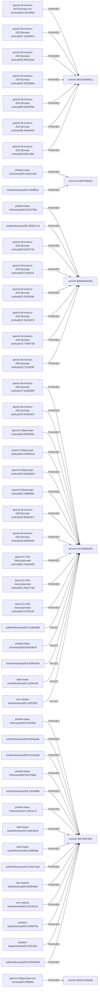

# attempt_registry

```mermaid
graph LR
  n1["qwen3-4b-instruct-2507/prompt-one-turn/exp001:63c3bf0a"]
  n2["commit 88d12e6846ce"]
  n3["qwen3-4b-instruct-2507/prompt-cot/exp007:1d3e96c4"]
  n4["qwen3-4b-instruct-2507/prompt-cot/exp002:8d2a31b4"]
  n5["qwen3-4b-instruct-2507/prompt-cot/exp003:4553090a"]
  n6["qwen3-4b-instruct-2507/prompt-cot/exp005:d4c5f94b"]
  n7["qwen3-4b-instruct-2507/prompt-cot/exp006:43aeb425"]
  n8["phobert-base-v2/lora/exp001:363c224e"]
  n9["commit aca047df2dc2"]
  n10["visobert/lora/exp001:83dff5ee"]
  n11["qwen3-4b-instruct-2507/prompt-cot/exp004:8b07affe"]
  n12["phobert-base-v2/lora/exp002:61097598"]
  n13["commit 8bfe96e0a352"]
  n14["visobert/lora/exp002:384b271d"]
  n15["qwen3-4b-instruct-2507/prompt-cot/exp008:d2ef77a9"]
  n16["qwen3-4b-instruct-2507/prompt-cot/exp009:7cf3331e"]
  n17["qwen3-4b-instruct-2507/prompt-cot/exp011:3c5cf0a0"]
  n18["qwen3-4b-instruct-2507/prompt-cot/exp012:33c2d270"]
  n19["qwen3-4b-instruct-2507/prompt-cot/exp013:779e8738"]
  n20["qwen3-4b-instruct-2507/prompt-cot/exp010:7011d28f"]
  n21["qwen3-4b-instruct-2507/prompt-cot/exp017:bcdb5855"]
  n22["commit 4571648fcb09"]
  n23["qwen3-4b-instruct-2507/prompt-cot/exp016:91564327"]
  n24["qwen3-0.6b/prompt-cot/exp004:6f52832b"]
  n25["qwen3-0.6b/prompt-cot/exp003:d785decb"]
  n26["qwen3-0.6b/prompt-cot/exp002:0ebdd004"]
  n27["qwen3-0.6b/prompt-cot/exp001:a38f368e"]
  n28["qwen3-4b-instruct-2507/prompt-cot/exp014:fbadcdc3"]
  n29["qwen3-4b-instruct-2507/prompt-cot/exp015:df4b8940"]
  n30["qwen2.5-0.5b-instruct/prompt-cot/exp002:7e42a450"]
  n31["qwen2.5-0.5b-instruct/prompt-cot/exp001:28cd778a"]
  n32["qwen2.5-0.5b-instruct/prompt-cot/exp003:47f42c95"]
  n33["cafebert/lora/exp001:61dbdddb"]
  n34["phobert-base-v2/lora/exp003:843cd8e9"]
  n35["visobert/lora/exp003:8346cb0d"]
  n36["vibert-base-cased/lora/exp001:a525cefe"]
  n37["xlm-roberta-base/lora/exp001:a2f22f02"]
  n38["phobert-base-v2/lora/exp003:c0033f3c"]
  n39["commit 59579e576fcf"]
  n40["visobert/lora/exp003:8b4aeafa"]
  n41["visobert/lora/exp005:511d1e85"]
  n42["phobert-base-v2/lora/exp005:9b7236ac"]
  n43["visobert/lora/exp004:1bc5e80b"]
  n44["phobert-base-v2/lora/exp004:14923c13"]
  n45["vibert-base-cased/lora/exp001:ba615bcb"]
  n46["vibert-base-cased/lora/exp002:4afd60ad"]
  n47["cafebert/lora/exp001:61871aed"]
  n48["xlm-roberta-base/lora/exp002:fb9643d0"]
  n49["xlm-roberta-base/lora/exp001:491e81cb"]
  n50["phobert-large/lora/exp002:2a95b70a"]
  n51["phobert-large/lora/exp001:f92f1d6c"]
  n52["cafebert/lora/exp002:93448395"]
  n53["qwen3-0.6b/prompt-one-turn/exp001:ff3fb8fa"]
  n54["commit 3942144da4de"]
  n1 -->|FINISHED| n2
  n3 -->|FINISHED| n2
  n4 -->|FINISHED| n2
  n5 -->|FINISHED| n2
  n6 -->|FINISHED| n2
  n7 -->|FINISHED| n2
  n8 -->|FINISHED| n9
  n10 -->|FINISHED| n9
  n11 -->|FINISHED| n2
  n12 -->|FINISHED| n13
  n14 -->|FINISHED| n13
  n15 -->|FINISHED| n13
  n16 -->|FINISHED| n13
  n17 -->|FINISHED| n13
  n18 -->|FINISHED| n13
  n19 -->|FINISHED| n13
  n20 -->|FINISHED| n13
  n21 -->|FINISHED| n22
  n23 -->|FINISHED| n22
  n24 -->|FINISHED| n22
  n25 -->|FINISHED| n22
  n26 -->|FINISHED| n22
  n27 -->|FINISHED| n22
  n28 -->|FINISHED| n22
  n29 -->|FINISHED| n22
  n30 -->|FINISHED| n22
  n31 -->|FINISHED| n22
  n32 -->|FINISHED| n22
  n33 -->|FAILED| n22
  n34 -->|FAILED| n22
  n35 -->|FAILED| n22
  n36 -->|FAILED| n22
  n37 -->|FAILED| n22
  n38 -->|FINISHED| n39
  n40 -->|FINISHED| n39
  n41 -->|FINISHED| n39
  n42 -->|FINISHED| n39
  n43 -->|FINISHED| n39
  n44 -->|FINISHED| n39
  n45 -->|FINISHED| n39
  n46 -->|FINISHED| n39
  n47 -->|FINISHED| n39
  n48 -->|FINISHED| n39
  n49 -->|FINISHED| n39
  n50 -->|FINISHED| n39
  n51 -->|FINISHED| n39
  n52 -->|FINISHED| n39
  n53 -->|FINISHED| n54
```
