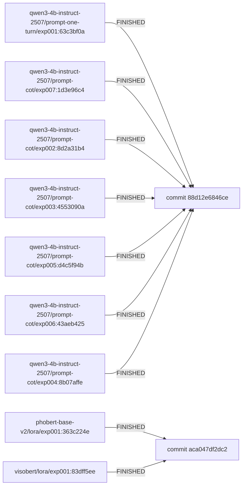

# attempt_registry

```mermaid
graph LR
  n1["qwen3-4b-instruct-2507/prompt-one-turn/exp001:63c3bf0a"]
  n2["commit 88d12e6846ce"]
  n3["qwen3-4b-instruct-2507/prompt-cot/exp007:1d3e96c4"]
  n4["qwen3-4b-instruct-2507/prompt-cot/exp002:8d2a31b4"]
  n5["qwen3-4b-instruct-2507/prompt-cot/exp003:4553090a"]
  n6["qwen3-4b-instruct-2507/prompt-cot/exp005:d4c5f94b"]
  n7["qwen3-4b-instruct-2507/prompt-cot/exp006:43aeb425"]
  n8["phobert-base-v2/lora/exp001:363c224e"]
  n9["commit aca047df2dc2"]
  n10["visobert/lora/exp001:83dff5ee"]
  n11["qwen3-4b-instruct-2507/prompt-cot/exp004:8b07affe"]
  n1 -->|FINISHED| n2
  n3 -->|FINISHED| n2
  n4 -->|FINISHED| n2
  n5 -->|FINISHED| n2
  n6 -->|FINISHED| n2
  n7 -->|FINISHED| n2
  n8 -->|FINISHED| n9
  n10 -->|FINISHED| n9
  n11 -->|FINISHED| n2
```
