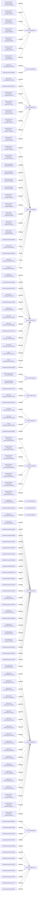

# attempt_registry

```mermaid
graph LR
  n1["qwen3-4b-instruct-2507/prompt-one-turn/exp001:63c3bf0a"]
  n2["commit 88d12e6846ce"]
  n3["qwen3-4b-instruct-2507/prompt-cot/exp007:1d3e96c4"]
  n4["qwen3-4b-instruct-2507/prompt-cot/exp002:8d2a31b4"]
  n5["qwen3-4b-instruct-2507/prompt-cot/exp003:4553090a"]
  n6["qwen3-4b-instruct-2507/prompt-cot/exp005:d4c5f94b"]
  n7["qwen3-4b-instruct-2507/prompt-cot/exp006:43aeb425"]
  n8["phobert-base-v2/lora/exp001:363c224e"]
  n9["commit aca047df2dc2"]
  n10["visobert/lora/exp001:83dff5ee"]
  n11["qwen3-4b-instruct-2507/prompt-cot/exp004:8b07affe"]
  n12["phobert-base-v2/lora/exp002:61097598"]
  n13["commit 8bfe96e0a352"]
  n14["visobert/lora/exp002:384b271d"]
  n15["qwen3-4b-instruct-2507/prompt-cot/exp008:d2ef77a9"]
  n16["qwen3-4b-instruct-2507/prompt-cot/exp009:7cf3331e"]
  n17["qwen3-4b-instruct-2507/prompt-cot/exp011:3c5cf0a0"]
  n18["qwen3-4b-instruct-2507/prompt-cot/exp012:33c2d270"]
  n19["qwen3-4b-instruct-2507/prompt-cot/exp013:779e8738"]
  n20["qwen3-4b-instruct-2507/prompt-cot/exp010:7011d28f"]
  n21["qwen3-4b-instruct-2507/prompt-cot/exp017:bcdb5855"]
  n22["commit 4571648fcb09"]
  n23["qwen3-4b-instruct-2507/prompt-cot/exp016:91564327"]
  n24["qwen3-0.6b/prompt-cot/exp004:6f52832b"]
  n25["qwen3-0.6b/prompt-cot/exp003:d785decb"]
  n26["qwen3-0.6b/prompt-cot/exp002:0ebdd004"]
  n27["qwen3-0.6b/prompt-cot/exp001:a38f368e"]
  n28["qwen3-4b-instruct-2507/prompt-cot/exp014:fbadcdc3"]
  n29["qwen3-4b-instruct-2507/prompt-cot/exp015:df4b8940"]
  n30["qwen2.5-0.5b-instruct/prompt-cot/exp002:7e42a450"]
  n31["qwen2.5-0.5b-instruct/prompt-cot/exp001:28cd778a"]
  n32["qwen2.5-0.5b-instruct/prompt-cot/exp003:47f42c95"]
  n33["cafebert/lora/exp001:61dbdddb"]
  n34["phobert-base-v2/lora/exp003:843cd8e9"]
  n35["visobert/lora/exp003:8346cb0d"]
  n36["vibert-base-cased/lora/exp001:a525cefe"]
  n37["xlm-roberta-base/lora/exp001:a2f22f02"]
  n38["phobert-base-v2/lora/exp003:c0033f3c"]
  n39["commit 59579e576fcf"]
  n40["visobert/lora/exp003:8b4aeafa"]
  n41["visobert/lora/exp005:511d1e85"]
  n42["phobert-base-v2/lora/exp005:9b7236ac"]
  n43["visobert/lora/exp004:1bc5e80b"]
  n44["phobert-base-v2/lora/exp004:14923c13"]
  n45["vibert-base-cased/lora/exp001:ba615bcb"]
  n46["vibert-base-cased/lora/exp002:4afd60ad"]
  n47["cafebert/lora/exp001:61871aed"]
  n48["xlm-roberta-base/lora/exp002:fb9643d0"]
  n49["xlm-roberta-base/lora/exp001:491e81cb"]
  n50["phobert-large/lora/exp002:2a95b70a"]
  n51["phobert-large/lora/exp001:f92f1d6c"]
  n52["cafebert/lora/exp002:93448395"]
  n53["qwen3-0.6b/prompt-one-turn/exp001:ff3fb8fa"]
  n54["commit 3942144da4de"]
  n55["qwen3-0.6b/prompt-cot/exp005:1eb94d3d"]
  n56["cafebert/lora/exp003:8cc11244"]
  n57["commit 05cb8c1e41bd"]
  n58["vibert-base-cased/lora/exp003:8e1703a6"]
  n59["cafebert/lora/exp004:43e6c243"]
  n60["xlm-roberta-base/lora/exp003:777fafbf"]
  n61["commit e27d958c8120"]
  n62["vibert-base-cased/lora/exp004:97cae249"]
  n63["phobert-large/lora/exp003:5b192ca8"]
  n64["cafebert/lora/exp005:cfbf68e4"]
  n65["qwen3-4b-instruct-2507/prompt-aspect/exp004:f39bc983"]
  n66["commit d42de24d5093"]
  n67["phobert-base-v2/lora/exp006:d0bfc92e"]
  n68["commit ca8b1a04a3fd"]
  n69["qwen3-4b-instruct-2507/prompt-aspect/exp005:4e11fb2e"]
  n70["qwen3-4b-instruct-2507/prompt-aspect/exp002:df008443"]
  n71["qwen3-4b-instruct-2507/prompt-aspect/exp007:aee896b8"]
  n72["qwen3-4b-instruct-2507/prompt-aspect/exp006:e3add676"]
  n73["qwen3-4b-instruct-2507/prompt-aspect/exp001:f04dd585"]
  n74["qwen3-4b-instruct-2507/prompt-aspect/exp003:5cab7e03"]
  n75["cafebert/lora/exp006:ba564752"]
  n76["commit 9746d0cdcff7"]
  n77["phobert-base-v2/lora/exp007:3e52a2a3"]
  n78["commit c82c20d8d1c3"]
  n79["phobert-base-v2/full/exp001:896017a6"]
  n80["commit 4f65864c4ed9"]
  n81["cafebert/lora/exp007:be5d198b"]
  n82["cafebert/lora/exp009:8139ebb5"]
  n83["cafebert/lora/exp011:c5224186"]
  n84["cafebert/lora/exp014:b8f33980"]
  n85["cafebert/lora/exp015:eb2b6cfa"]
  n86["cafebert/lora/exp013:bb5a16ba"]
  n87["cafebert/lora/exp008:bb1f4def"]
  n88["cafebert/none/exp002:fd8971e0"]
  n89["cafebert/lora/exp016:4cba4ba7"]
  n90["cafebert/lora/exp017:5ebc6a84"]
  n91["cafebert/lora/exp018:416a1325"]
  n92["phobert-base-v2/none/exp001:91fc1ff0"]
  n93["cafebert/none/exp001:ee0c0c55"]
  n94["phobert-base-v2/none/exp002:5f0ccd74"]
  n95["cafebert/lora/exp019:850333b8"]
  n96["phobert-base-v2/full/exp002:6b4d075b"]
  n97["phobert-base-v2/lora/exp008:4155a02d"]
  n98["commit 2850d0349267"]
  n99["phobert-base-v2/lora/exp009:34eadc41"]
  n100["phobert-base-v2/lora/exp010:76d15212"]
  n101["phobert-base-v2/lora/exp011:609b3936"]
  n102["phobert-base-v2/lora/exp012:5f7bafcd"]
  n103["visobert/lora/exp006:e6589d12"]
  n104["commit a0a52404fbca"]
  n105["visobert/lora/exp009:f784f0b6"]
  n106["visobert/lora/exp008:418c15d6"]
  n107["visobert/lora/exp007:428031b7"]
  n108["qwen3-8b/prompt-cot/exp002:fd1b541e"]
  n109["qwen3-8b/prompt-cot/exp001:f5032055"]
  n110["phobert-base-v2/lora/exp013:354d4577"]
  n111["phobert-base-v2/lora/exp014:3c843f8c"]
  n112["phobert-base-v2/lora/exp015:611af219"]
  n113["phobert-base-v2/lora/exp016:a79a4018"]
  n114["phobert-base-v2/lora/exp018:cf826a43"]
  n115["phobert-base-v2/lora/exp019:b330ac39"]
  n116["phobert-base-v2/lora/exp020:4bb386b8"]
  n117["phobert-base-v2/lora/exp023:034fe8e1"]
  n118["phobert-base-v2/lora/exp021:df66fb42"]
  n119["phobert-base-v2/lora/exp022:ddca71d7"]
  n120["cafebert/lora/exp012:688c32bc"]
  n121["phobert-base-v2/lora/exp017:9be4142b"]
  n122["cafebert/lora/exp010:cb2a0164"]
  n123["mistral-7b-instruct-v0.3/prompt-cot/exp001:667336e2"]
  n124["mistral-7b-instruct-v0.3/prompt-cot/exp002:9c8d8391"]
  n125["cafebert/full/exp001:2a1c06a8"]
  n126["qwen3-8b/prompt-cot/exp003:38ba3bf6"]
  n127["cafebert/lora/exp020:2c63348a"]
  n128["commit 2ba65eac1478"]
  n129["cafebert/lora/exp021:4653ddfc"]
  n130["cafebert/lora/exp024:1f009653"]
  n131["cafebert/lora/exp025:9d276e42"]
  n132["cafebert/lora/exp027:43e40f61"]
  n133["cafebert/lora/exp028:d17056e5"]
  n134["cafebert/lora/exp030:1ce21c75"]
  n135["cafebert/lora/exp033:5e2847fc"]
  n136["mistral-7b-instruct-v0.3/prompt-cot/exp003:4a1f6428"]
  n1 -->|FINISHED| n2
  n3 -->|FINISHED| n2
  n4 -->|FINISHED| n2
  n5 -->|FINISHED| n2
  n6 -->|FINISHED| n2
  n7 -->|FINISHED| n2
  n8 -->|FINISHED| n9
  n10 -->|FINISHED| n9
  n11 -->|FINISHED| n2
  n12 -->|FINISHED| n13
  n14 -->|FINISHED| n13
  n15 -->|FINISHED| n13
  n16 -->|FINISHED| n13
  n17 -->|FINISHED| n13
  n18 -->|FINISHED| n13
  n19 -->|FINISHED| n13
  n20 -->|FINISHED| n13
  n21 -->|FINISHED| n22
  n23 -->|FINISHED| n22
  n24 -->|FINISHED| n22
  n25 -->|FINISHED| n22
  n26 -->|FINISHED| n22
  n27 -->|FINISHED| n22
  n28 -->|FINISHED| n22
  n29 -->|FINISHED| n22
  n30 -->|FINISHED| n22
  n31 -->|FINISHED| n22
  n32 -->|FINISHED| n22
  n33 -->|FAILED| n22
  n34 -->|FAILED| n22
  n35 -->|FAILED| n22
  n36 -->|FAILED| n22
  n37 -->|FAILED| n22
  n38 -->|FINISHED| n39
  n40 -->|FINISHED| n39
  n41 -->|FINISHED| n39
  n42 -->|FINISHED| n39
  n43 -->|FINISHED| n39
  n44 -->|FINISHED| n39
  n45 -->|FINISHED| n39
  n46 -->|FINISHED| n39
  n47 -->|FINISHED| n39
  n48 -->|FINISHED| n39
  n49 -->|FINISHED| n39
  n50 -->|FINISHED| n39
  n51 -->|FINISHED| n39
  n52 -->|FINISHED| n39
  n53 -->|FINISHED| n54
  n55 -->|FINISHED| n54
  n56 -->|FINISHED| n57
  n58 -->|FINISHED| n57
  n59 -->|FINISHED| n57
  n60 -->|FINISHED| n61
  n62 -->|FINISHED| n61
  n63 -->|FINISHED| n61
  n64 -->|FINISHED| n61
  n65 -->|FINISHED| n66
  n67 -->|FINISHED| n68
  n69 -->|FINISHED| n66
  n70 -->|FINISHED| n66
  n71 -->|FINISHED| n66
  n72 -->|FINISHED| n66
  n73 -->|FINISHED| n66
  n74 -->|FINISHED| n66
  n75 -->|FINISHED| n76
  n77 -->|FINISHED| n78
  n79 -->|FINISHED| n80
  n81 -->|FINISHED| n80
  n82 -->|FINISHED| n80
  n83 -->|FINISHED| n80
  n84 -->|FINISHED| n80
  n85 -->|FINISHED| n80
  n86 -->|FINISHED| n80
  n87 -->|FINISHED| n80
  n88 -->|FINISHED| n80
  n89 -->|FINISHED| n80
  n90 -->|FINISHED| n80
  n91 -->|FINISHED| n80
  n92 -->|FINISHED| n80
  n93 -->|FINISHED| n80
  n94 -->|FINISHED| n80
  n95 -->|FINISHED| n80
  n96 -->|FINISHED| n80
  n97 -->|FINISHED| n98
  n99 -->|FINISHED| n98
  n100 -->|FINISHED| n98
  n101 -->|FINISHED| n98
  n102 -->|FINISHED| n98
  n103 -->|FINISHED| n104
  n105 -->|FINISHED| n104
  n106 -->|FINISHED| n104
  n107 -->|FINISHED| n104
  n108 -->|FINISHED| n80
  n109 -->|FINISHED| n80
  n110 -->|FINISHED| n98
  n111 -->|FINISHED| n98
  n112 -->|FINISHED| n98
  n113 -->|FINISHED| n98
  n114 -->|FINISHED| n98
  n115 -->|FINISHED| n98
  n116 -->|FINISHED| n98
  n117 -->|FINISHED| n98
  n118 -->|FINISHED| n98
  n119 -->|FINISHED| n98
  n120 -->|FINISHED| n80
  n121 -->|FINISHED| n98
  n122 -->|FINISHED| n80
  n123 -->|FINISHED| n98
  n124 -->|FINISHED| n98
  n125 -->|RUNNING| n80
  n126 -->|FINISHED| n80
  n127 -->|FINISHED| n128
  n129 -->|FINISHED| n128
  n130 -->|FINISHED| n128
  n131 -->|FINISHED| n128
  n132 -->|FINISHED| n128
  n133 -->|FINISHED| n128
  n134 -->|FINISHED| n128
  n135 -->|FINISHED| n128
  n136 -->|FINISHED| n98
```
