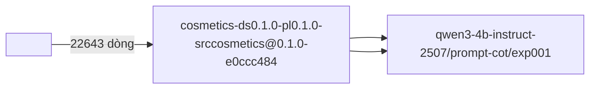

# dataset_registry

```mermaid
graph LR
  n1["<nguồn v0.1.0>"]
  n2["cosmetics-ds0.1.0-pl0.1.0-srccosmetics@0.1.0-e0ccc484"]
  n3["qwen3-4b-instruct-2507/prompt-cot/exp001"]
  n1 -->|22643 dòng| n2
  n2 --> n3
  n2 --> n3
```
