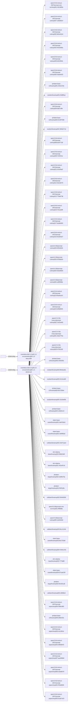

# dataset_registry

```mermaid
graph LR
  n1["<nguồn v0.1.0>"]
  n2["cosmetics-ds0.1.0-pl0.1.0-srccosmetics@0.1.0-e0ccc484"]
  n3["<nguồn v0.2.0>"]
  n4["cosmetics-ds0.2.0-pl0.2.0-srccosmetics@0.1.0-e616c1e3"]
  n5["qwen3-4b-instruct-2507/prompt-one-turn/exp001:63c3bf0a"]
  n6["qwen3-4b-instruct-2507/prompt-cot/exp007:1d3e96c4"]
  n7["qwen3-4b-instruct-2507/prompt-cot/exp002:8d2a31b4"]
  n8["qwen3-4b-instruct-2507/prompt-cot/exp003:4553090a"]
  n9["qwen3-4b-instruct-2507/prompt-cot/exp005:d4c5f94b"]
  n10["qwen3-4b-instruct-2507/prompt-cot/exp006:43aeb425"]
  n11["phobert-base-v2/lora/exp001:363c224e"]
  n12["visobert/lora/exp001:83dff5ee"]
  n13["qwen3-4b-instruct-2507/prompt-cot/exp004:8b07affe"]
  n14["phobert-base-v2/lora/exp002:61097598"]
  n15["visobert/lora/exp002:384b271d"]
  n16["qwen3-4b-instruct-2507/prompt-cot/exp008:d2ef77a9"]
  n17["qwen3-4b-instruct-2507/prompt-cot/exp009:7cf3331e"]
  n18["qwen3-4b-instruct-2507/prompt-cot/exp011:3c5cf0a0"]
  n19["qwen3-4b-instruct-2507/prompt-cot/exp012:33c2d270"]
  n20["qwen3-4b-instruct-2507/prompt-cot/exp013:779e8738"]
  n21["qwen3-4b-instruct-2507/prompt-cot/exp010:7011d28f"]
  n22["qwen3-4b-instruct-2507/prompt-cot/exp017:bcdb5855"]
  n23["qwen3-4b-instruct-2507/prompt-cot/exp016:91564327"]
  n24["qwen3-0.6b/prompt-cot/exp004:6f52832b"]
  n25["qwen3-0.6b/prompt-cot/exp003:d785decb"]
  n26["qwen3-0.6b/prompt-cot/exp002:0ebdd004"]
  n27["qwen3-0.6b/prompt-cot/exp001:a38f368e"]
  n28["qwen3-4b-instruct-2507/prompt-cot/exp014:fbadcdc3"]
  n29["qwen3-4b-instruct-2507/prompt-cot/exp015:df4b8940"]
  n30["qwen2.5-0.5b-instruct/prompt-cot/exp002:7e42a450"]
  n31["qwen2.5-0.5b-instruct/prompt-cot/exp001:28cd778a"]
  n32["qwen2.5-0.5b-instruct/prompt-cot/exp003:47f42c95"]
  n33["phobert-base-v2/lora/exp003:c0033f3c"]
  n34["visobert/lora/exp003:8b4aeafa"]
  n35["visobert/lora/exp005:511d1e85"]
  n36["phobert-base-v2/lora/exp005:9b7236ac"]
  n37["visobert/lora/exp004:1bc5e80b"]
  n38["phobert-base-v2/lora/exp004:14923c13"]
  n39["vibert-base-cased/lora/exp001:ba615bcb"]
  n40["vibert-base-cased/lora/exp002:4afd60ad"]
  n41["cafebert/lora/exp001:61871aed"]
  n42["xlm-roberta-base/lora/exp002:fb9643d0"]
  n43["xlm-roberta-base/lora/exp001:491e81cb"]
  n44["phobert-large/lora/exp002:2a95b70a"]
  n45["phobert-large/lora/exp001:f92f1d6c"]
  n46["cafebert/lora/exp002:93448395"]
  n47["qwen3-0.6b/prompt-one-turn/exp001:ff3fb8fa"]
  n48["qwen3-0.6b/prompt-cot/exp005:1eb94d3d"]
  n49["cafebert/lora/exp003:8cc11244"]
  n50["vibert-base-cased/lora/exp003:8e1703a6"]
  n51["cafebert/lora/exp004:43e6c243"]
  n52["xlm-roberta-base/lora/exp003:777fafbf"]
  n53["vibert-base-cased/lora/exp004:97cae249"]
  n54["phobert-large/lora/exp003:5b192ca8"]
  n55["cafebert/lora/exp005:cfbf68e4"]
  n56["qwen3-4b-instruct-2507/prompt-aspect/exp004:f39bc983"]
  n57["phobert-base-v2/lora/exp006:d0bfc92e"]
  n58["qwen3-4b-instruct-2507/prompt-aspect/exp005:4e11fb2e"]
  n59["qwen3-4b-instruct-2507/prompt-aspect/exp002:df008443"]
  n60["qwen3-4b-instruct-2507/prompt-aspect/exp007:aee896b8"]
  n61["qwen3-4b-instruct-2507/prompt-aspect/exp006:e3add676"]
  n62["qwen3-4b-instruct-2507/prompt-aspect/exp001:f04dd585"]
  n63["qwen3-4b-instruct-2507/prompt-aspect/exp003:5cab7e03"]
  n1 -->|15344 dòng| n2
  n3 -->|15426 dòng| n4
  n4 --> n5
  n4 --> n6
  n4 --> n7
  n4 --> n8
  n4 --> n9
  n4 --> n10
  n4 --> n11
  n4 --> n12
  n4 --> n13
  n4 --> n14
  n4 --> n15
  n4 --> n16
  n4 --> n17
  n4 --> n18
  n4 --> n19
  n4 --> n20
  n4 --> n21
  n4 --> n22
  n4 --> n23
  n4 --> n24
  n4 --> n25
  n4 --> n26
  n4 --> n27
  n4 --> n28
  n4 --> n29
  n4 --> n30
  n4 --> n31
  n4 --> n32
  n4 --> n33
  n4 --> n34
  n4 --> n35
  n4 --> n36
  n4 --> n37
  n4 --> n38
  n4 --> n39
  n4 --> n40
  n4 --> n41
  n4 --> n42
  n4 --> n43
  n4 --> n44
  n4 --> n45
  n4 --> n46
  n4 --> n47
  n4 --> n48
  n4 --> n49
  n4 --> n50
  n4 --> n51
  n4 --> n52
  n4 --> n53
  n4 --> n54
  n4 --> n55
  n4 --> n56
  n4 --> n57
  n4 --> n58
  n4 --> n59
  n4 --> n60
  n4 --> n61
  n4 --> n62
  n4 --> n63
```
