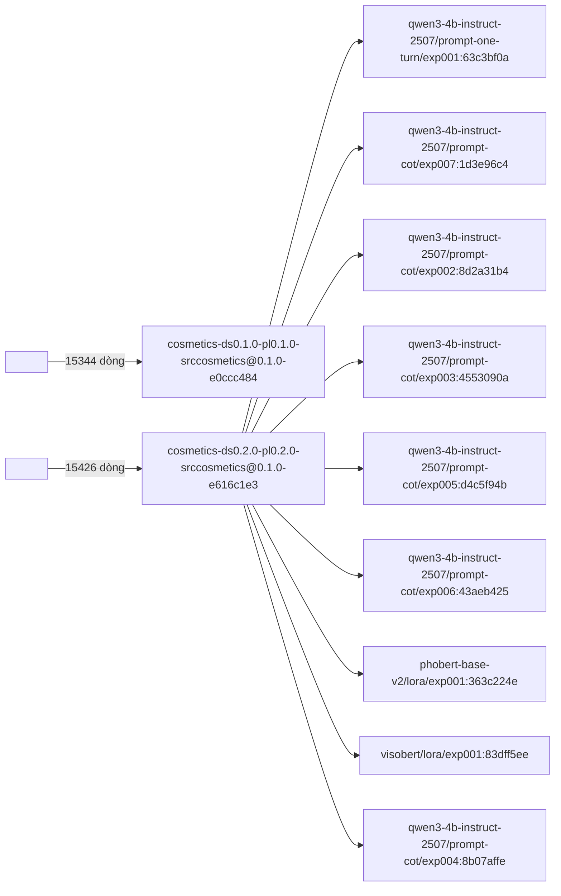

# dataset_registry

```mermaid
graph LR
  n1["<nguồn v0.1.0>"]
  n2["cosmetics-ds0.1.0-pl0.1.0-srccosmetics@0.1.0-e0ccc484"]
  n3["<nguồn v0.2.0>"]
  n4["cosmetics-ds0.2.0-pl0.2.0-srccosmetics@0.1.0-e616c1e3"]
  n5["qwen3-4b-instruct-2507/prompt-one-turn/exp001:63c3bf0a"]
  n6["qwen3-4b-instruct-2507/prompt-cot/exp007:1d3e96c4"]
  n7["qwen3-4b-instruct-2507/prompt-cot/exp002:8d2a31b4"]
  n8["qwen3-4b-instruct-2507/prompt-cot/exp003:4553090a"]
  n9["qwen3-4b-instruct-2507/prompt-cot/exp005:d4c5f94b"]
  n10["qwen3-4b-instruct-2507/prompt-cot/exp006:43aeb425"]
  n11["phobert-base-v2/lora/exp001:363c224e"]
  n12["visobert/lora/exp001:83dff5ee"]
  n13["qwen3-4b-instruct-2507/prompt-cot/exp004:8b07affe"]
  n1 -->|15344 dòng| n2
  n3 -->|15426 dòng| n4
  n4 --> n5
  n4 --> n6
  n4 --> n7
  n4 --> n8
  n4 --> n9
  n4 --> n10
  n4 --> n11
  n4 --> n12
  n4 --> n13
```
