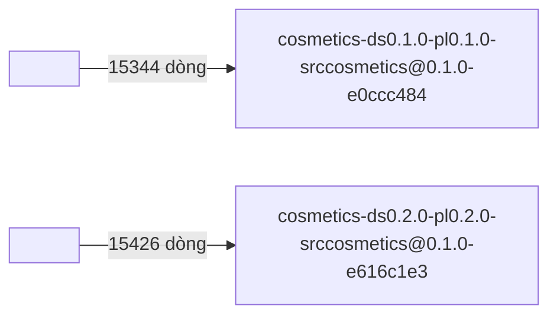

# dataset_registry

```mermaid
graph LR
  n1["<nguồn v0.1.0>"]
  n2["cosmetics-ds0.1.0-pl0.1.0-srccosmetics@0.1.0-e0ccc484"]
  n3["<nguồn v0.2.0>"]
  n4["cosmetics-ds0.2.0-pl0.2.0-srccosmetics@0.1.0-e616c1e3"]
  n1 -->|15344 dòng| n2
  n3 -->|15426 dòng| n4
```
