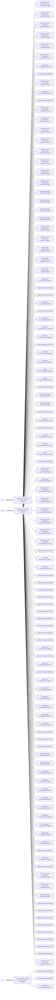

# dataset_registry

```mermaid
graph LR
  n1["<nguồn v0.1.0>"]
  n2["cosmetics-ds0.1.0-pl0.1.0-srccosmetics@0.1.0-e0ccc484"]
  n3["<nguồn v0.2.0>"]
  n4["cosmetics-ds0.2.0-pl0.2.0-srccosmetics@0.1.0-e616c1e3"]
  n5["qwen3-4b-instruct-2507/prompt-one-turn/exp001:63c3bf0a"]
  n6["qwen3-4b-instruct-2507/prompt-cot/exp007:1d3e96c4"]
  n7["qwen3-4b-instruct-2507/prompt-cot/exp002:8d2a31b4"]
  n8["qwen3-4b-instruct-2507/prompt-cot/exp003:4553090a"]
  n9["qwen3-4b-instruct-2507/prompt-cot/exp005:d4c5f94b"]
  n10["qwen3-4b-instruct-2507/prompt-cot/exp006:43aeb425"]
  n11["phobert-base-v2/lora/exp001:363c224e"]
  n12["visobert/lora/exp001:83dff5ee"]
  n13["qwen3-4b-instruct-2507/prompt-cot/exp004:8b07affe"]
  n14["phobert-base-v2/lora/exp002:61097598"]
  n15["visobert/lora/exp002:384b271d"]
  n16["qwen3-4b-instruct-2507/prompt-cot/exp008:d2ef77a9"]
  n17["qwen3-4b-instruct-2507/prompt-cot/exp009:7cf3331e"]
  n18["qwen3-4b-instruct-2507/prompt-cot/exp011:3c5cf0a0"]
  n19["qwen3-4b-instruct-2507/prompt-cot/exp012:33c2d270"]
  n20["qwen3-4b-instruct-2507/prompt-cot/exp013:779e8738"]
  n21["qwen3-4b-instruct-2507/prompt-cot/exp010:7011d28f"]
  n22["qwen3-4b-instruct-2507/prompt-cot/exp017:bcdb5855"]
  n23["qwen3-4b-instruct-2507/prompt-cot/exp016:91564327"]
  n24["qwen3-0.6b/prompt-cot/exp004:6f52832b"]
  n25["qwen3-0.6b/prompt-cot/exp003:d785decb"]
  n26["qwen3-0.6b/prompt-cot/exp002:0ebdd004"]
  n27["qwen3-0.6b/prompt-cot/exp001:a38f368e"]
  n28["qwen3-4b-instruct-2507/prompt-cot/exp014:fbadcdc3"]
  n29["qwen3-4b-instruct-2507/prompt-cot/exp015:df4b8940"]
  n30["qwen2.5-0.5b-instruct/prompt-cot/exp002:7e42a450"]
  n31["qwen2.5-0.5b-instruct/prompt-cot/exp001:28cd778a"]
  n32["qwen2.5-0.5b-instruct/prompt-cot/exp003:47f42c95"]
  n33["phobert-base-v2/lora/exp003:c0033f3c"]
  n34["visobert/lora/exp003:8b4aeafa"]
  n35["visobert/lora/exp005:511d1e85"]
  n36["phobert-base-v2/lora/exp005:9b7236ac"]
  n37["visobert/lora/exp004:1bc5e80b"]
  n38["phobert-base-v2/lora/exp004:14923c13"]
  n39["vibert-base-cased/lora/exp001:ba615bcb"]
  n40["vibert-base-cased/lora/exp002:4afd60ad"]
  n41["cafebert/lora/exp001:61871aed"]
  n42["xlm-roberta-base/lora/exp002:fb9643d0"]
  n43["xlm-roberta-base/lora/exp001:491e81cb"]
  n44["phobert-large/lora/exp002:2a95b70a"]
  n45["phobert-large/lora/exp001:f92f1d6c"]
  n46["cafebert/lora/exp002:93448395"]
  n47["qwen3-0.6b/prompt-one-turn/exp001:ff3fb8fa"]
  n48["qwen3-0.6b/prompt-cot/exp005:1eb94d3d"]
  n49["cafebert/lora/exp003:8cc11244"]
  n50["vibert-base-cased/lora/exp003:8e1703a6"]
  n51["cafebert/lora/exp004:43e6c243"]
  n52["xlm-roberta-base/lora/exp003:777fafbf"]
  n53["vibert-base-cased/lora/exp004:97cae249"]
  n54["phobert-large/lora/exp003:5b192ca8"]
  n55["cafebert/lora/exp005:cfbf68e4"]
  n56["qwen3-4b-instruct-2507/prompt-aspect/exp004:f39bc983"]
  n57["phobert-base-v2/lora/exp006:d0bfc92e"]
  n58["qwen3-4b-instruct-2507/prompt-aspect/exp005:4e11fb2e"]
  n59["qwen3-4b-instruct-2507/prompt-aspect/exp002:df008443"]
  n60["qwen3-4b-instruct-2507/prompt-aspect/exp007:aee896b8"]
  n61["qwen3-4b-instruct-2507/prompt-aspect/exp006:e3add676"]
  n62["qwen3-4b-instruct-2507/prompt-aspect/exp001:f04dd585"]
  n63["qwen3-4b-instruct-2507/prompt-aspect/exp003:5cab7e03"]
  n64["cafebert/lora/exp006:ba564752"]
  n65["phobert-base-v2/lora/exp007:3e52a2a3"]
  n66["phobert-base-v2/full/exp001:896017a6"]
  n67["cafebert/lora/exp007:be5d198b"]
  n68["cafebert/lora/exp009:8139ebb5"]
  n69["cafebert/lora/exp014:b8f33980"]
  n70["cafebert/lora/exp015:eb2b6cfa"]
  n71["cafebert/lora/exp013:bb5a16ba"]
  n72["cafebert/lora/exp008:bb1f4def"]
  n73["cafebert/none/exp002:fd8971e0"]
  n74["cafebert/lora/exp016:4cba4ba7"]
  n75["cafebert/lora/exp017:5ebc6a84"]
  n76["cafebert/lora/exp018:416a1325"]
  n77["phobert-base-v2/none/exp001:91fc1ff0"]
  n78["cafebert/none/exp001:ee0c0c55"]
  n79["phobert-base-v2/none/exp002:5f0ccd74"]
  n80["cafebert/lora/exp019:850333b8"]
  n81["phobert-base-v2/full/exp002:6b4d075b"]
  n82["phobert-base-v2/lora/exp008:4155a02d"]
  n83["phobert-base-v2/lora/exp009:34eadc41"]
  n84["phobert-base-v2/lora/exp010:76d15212"]
  n85["phobert-base-v2/lora/exp011:609b3936"]
  n86["phobert-base-v2/lora/exp012:5f7bafcd"]
  n87["visobert/lora/exp006:e6589d12"]
  n88["visobert/lora/exp008:418c15d6"]
  n89["visobert/lora/exp007:428031b7"]
  n90["qwen3-8b/prompt-cot/exp002:fd1b541e"]
  n91["qwen3-8b/prompt-cot/exp001:f5032055"]
  n92["phobert-base-v2/lora/exp013:354d4577"]
  n93["phobert-base-v2/lora/exp014:3c843f8c"]
  n94["phobert-base-v2/lora/exp016:a79a4018"]
  n95["phobert-base-v2/lora/exp018:cf826a43"]
  n96["phobert-base-v2/lora/exp019:b330ac39"]
  n97["phobert-base-v2/lora/exp020:4bb386b8"]
  n98["phobert-base-v2/lora/exp023:034fe8e1"]
  n99["phobert-base-v2/lora/exp021:df66fb42"]
  n100["phobert-base-v2/lora/exp022:ddca71d7"]
  n101["cafebert/lora/exp012:688c32bc"]
  n102["phobert-base-v2/lora/exp017:9be4142b"]
  n103["cafebert/lora/exp010:cb2a0164"]
  n104["mistral-7b-instruct-v0.3/prompt-cot/exp001:667336e2"]
  n105["mistral-7b-instruct-v0.3/prompt-cot/exp002:9c8d8391"]
  n106["qwen3-8b/prompt-cot/exp003:38ba3bf6"]
  n107["cafebert/lora/exp020:2c63348a"]
  n108["cafebert/lora/exp021:4653ddfc"]
  n109["cafebert/lora/exp024:1f009653"]
  n110["cafebert/lora/exp025:9d276e42"]
  n111["cafebert/lora/exp027:43e40f61"]
  n112["cafebert/lora/exp028:d17056e5"]
  n113["cafebert/lora/exp030:1ce21c75"]
  n114["cafebert/lora/exp033:5e2847fc"]
  n115["mistral-7b-instruct-v0.3/prompt-cot/exp003:4a1f6428"]
  n116["<nguồn v0.3.0>"]
  n117["cosmetics-ds0.3.0-pl0.3.0-srccosmetics@0.1.0-daebf6ba"]
  n118["cafebert/lora/exp011:c5224186"]
  n119["visobert/lora/exp009:f784f0b6"]
  n120["phobert-base-v2/lora/exp015:611af219"]
  n1 -->|15344 dòng| n2
  n3 -->|15426 dòng| n4
  n4 --> n5
  n4 --> n6
  n4 --> n7
  n4 --> n8
  n4 --> n9
  n4 --> n10
  n4 --> n11
  n4 --> n12
  n4 --> n13
  n4 --> n14
  n4 --> n15
  n4 --> n16
  n4 --> n17
  n4 --> n18
  n4 --> n19
  n4 --> n20
  n4 --> n21
  n4 --> n22
  n4 --> n23
  n4 --> n24
  n4 --> n25
  n4 --> n26
  n4 --> n27
  n4 --> n28
  n4 --> n29
  n4 --> n30
  n4 --> n31
  n4 --> n32
  n4 --> n33
  n4 --> n34
  n4 --> n35
  n4 --> n36
  n4 --> n37
  n4 --> n38
  n4 --> n39
  n4 --> n40
  n4 --> n41
  n4 --> n42
  n4 --> n43
  n4 --> n44
  n4 --> n45
  n4 --> n46
  n4 --> n47
  n4 --> n48
  n4 --> n49
  n4 --> n50
  n4 --> n51
  n4 --> n52
  n4 --> n53
  n4 --> n54
  n4 --> n55
  n4 --> n56
  n4 --> n57
  n4 --> n58
  n4 --> n59
  n4 --> n60
  n4 --> n61
  n4 --> n62
  n4 --> n63
  n4 --> n64
  n4 --> n65
  n4 --> n66
  n4 --> n67
  n4 --> n68
  n4 --> n69
  n4 --> n70
  n4 --> n71
  n4 --> n72
  n4 --> n73
  n4 --> n74
  n4 --> n75
  n4 --> n76
  n4 --> n77
  n4 --> n78
  n4 --> n79
  n4 --> n80
  n4 --> n81
  n4 --> n82
  n4 --> n83
  n4 --> n84
  n4 --> n85
  n4 --> n86
  n4 --> n87
  n4 --> n88
  n4 --> n89
  n4 --> n90
  n4 --> n91
  n4 --> n92
  n4 --> n93
  n4 --> n94
  n4 --> n95
  n4 --> n96
  n4 --> n97
  n4 --> n98
  n4 --> n99
  n4 --> n100
  n4 --> n101
  n4 --> n102
  n4 --> n103
  n4 --> n104
  n4 --> n105
  n4 --> n106
  n4 --> n107
  n4 --> n108
  n4 --> n109
  n4 --> n110
  n4 --> n111
  n4 --> n112
  n4 --> n113
  n4 --> n114
  n4 --> n115
  n116 -->|15426 dòng| n117
  n117 --> n118
  n117 --> n119
  n117 --> n120
```
