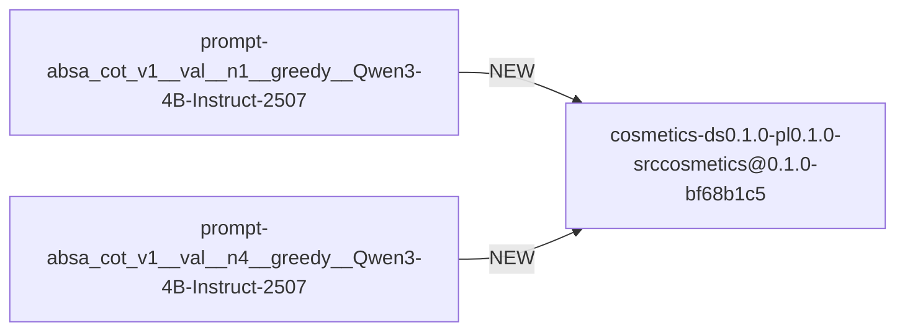

# experiment_registry

```mermaid
graph LR
  n1["prompt-absa_cot_v1__val__n1__greedy__Qwen3-4B-Instruct-2507"]
  n2["cosmetics-ds0.1.0-pl0.1.0-srccosmetics@0.1.0-bf68b1c5"]
  n3["prompt-absa_cot_v1__val__n4__greedy__Qwen3-4B-Instruct-2507"]
  n1 -->|NEW| n2
  n3 -->|NEW| n2
```
