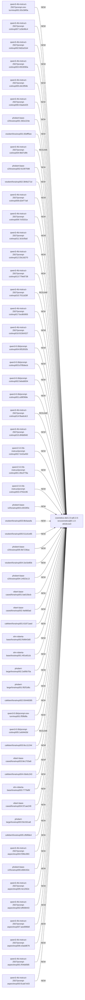

# experiment_registry

```mermaid
graph LR
  n1["qwen3-4b-instruct-2507/prompt-one-turn/exp001:63c3bf0a"]
  n2["cosmetics-ds0.2.0-pl0.2.0-srccosmetics@0.1.0-e616c1e3"]
  n3["qwen3-4b-instruct-2507/prompt-cot/exp007:1d3e96c4"]
  n4["qwen3-4b-instruct-2507/prompt-cot/exp002:8d2a31b4"]
  n5["qwen3-4b-instruct-2507/prompt-cot/exp003:4553090a"]
  n6["qwen3-4b-instruct-2507/prompt-cot/exp005:d4c5f94b"]
  n7["qwen3-4b-instruct-2507/prompt-cot/exp006:43aeb425"]
  n8["phobert-base-v2/lora/exp001:363c224e"]
  n9["visobert/lora/exp001:83dff5ee"]
  n10["qwen3-4b-instruct-2507/prompt-cot/exp004:8b07affe"]
  n11["phobert-base-v2/lora/exp002:61097598"]
  n12["visobert/lora/exp002:384b271d"]
  n13["qwen3-4b-instruct-2507/prompt-cot/exp008:d2ef77a9"]
  n14["qwen3-4b-instruct-2507/prompt-cot/exp009:7cf3331e"]
  n15["qwen3-4b-instruct-2507/prompt-cot/exp011:3c5cf0a0"]
  n16["qwen3-4b-instruct-2507/prompt-cot/exp012:33c2d270"]
  n17["qwen3-4b-instruct-2507/prompt-cot/exp013:779e8738"]
  n18["qwen3-4b-instruct-2507/prompt-cot/exp010:7011d28f"]
  n19["qwen3-4b-instruct-2507/prompt-cot/exp017:bcdb5855"]
  n20["qwen3-4b-instruct-2507/prompt-cot/exp016:91564327"]
  n21["qwen3-0.6b/prompt-cot/exp004:6f52832b"]
  n22["qwen3-0.6b/prompt-cot/exp003:d785decb"]
  n23["qwen3-0.6b/prompt-cot/exp002:0ebdd004"]
  n24["qwen3-0.6b/prompt-cot/exp001:a38f368e"]
  n25["qwen3-4b-instruct-2507/prompt-cot/exp014:fbadcdc3"]
  n26["qwen3-4b-instruct-2507/prompt-cot/exp015:df4b8940"]
  n27["qwen2.5-0.5b-instruct/prompt-cot/exp002:7e42a450"]
  n28["qwen2.5-0.5b-instruct/prompt-cot/exp001:28cd778a"]
  n29["qwen2.5-0.5b-instruct/prompt-cot/exp003:47f42c95"]
  n30["phobert-base-v2/lora/exp003:c0033f3c"]
  n31["visobert/lora/exp003:8b4aeafa"]
  n32["visobert/lora/exp005:511d1e85"]
  n33["phobert-base-v2/lora/exp005:9b7236ac"]
  n34["visobert/lora/exp004:1bc5e80b"]
  n35["phobert-base-v2/lora/exp004:14923c13"]
  n36["vibert-base-cased/lora/exp001:ba615bcb"]
  n37["vibert-base-cased/lora/exp002:4afd60ad"]
  n38["cafebert/lora/exp001:61871aed"]
  n39["xlm-roberta-base/lora/exp002:fb9643d0"]
  n40["xlm-roberta-base/lora/exp001:491e81cb"]
  n41["phobert-large/lora/exp002:2a95b70a"]
  n42["phobert-large/lora/exp001:f92f1d6c"]
  n43["cafebert/lora/exp002:93448395"]
  n44["qwen3-0.6b/prompt-one-turn/exp001:ff3fb8fa"]
  n45["qwen3-0.6b/prompt-cot/exp005:1eb94d3d"]
  n46["cafebert/lora/exp003:8cc11244"]
  n47["vibert-base-cased/lora/exp003:8e1703a6"]
  n48["cafebert/lora/exp004:43e6c243"]
  n49["xlm-roberta-base/lora/exp003:777fafbf"]
  n50["vibert-base-cased/lora/exp004:97cae249"]
  n51["phobert-large/lora/exp003:5b192ca8"]
  n52["cafebert/lora/exp005:cfbf68e4"]
  n53["qwen3-4b-instruct-2507/prompt-aspect/exp004:f39bc983"]
  n54["phobert-base-v2/lora/exp006:d0bfc92e"]
  n55["qwen3-4b-instruct-2507/prompt-aspect/exp005:4e11fb2e"]
  n56["qwen3-4b-instruct-2507/prompt-aspect/exp002:df008443"]
  n57["qwen3-4b-instruct-2507/prompt-aspect/exp007:aee896b8"]
  n58["qwen3-4b-instruct-2507/prompt-aspect/exp006:e3add676"]
  n59["qwen3-4b-instruct-2507/prompt-aspect/exp001:f04dd585"]
  n60["qwen3-4b-instruct-2507/prompt-aspect/exp003:5cab7e03"]
  n1 -->|NEW| n2
  n3 -->|NEW| n2
  n4 -->|NEW| n2
  n5 -->|NEW| n2
  n6 -->|NEW| n2
  n7 -->|NEW| n2
  n8 -->|NEW| n2
  n9 -->|NEW| n2
  n10 -->|RESUME| n2
  n11 -->|NEW| n2
  n12 -->|NEW| n2
  n13 -->|NEW| n2
  n14 -->|NEW| n2
  n15 -->|NEW| n2
  n16 -->|NEW| n2
  n17 -->|NEW| n2
  n18 -->|RESUME| n2
  n19 -->|NEW| n2
  n20 -->|NEW| n2
  n21 -->|NEW| n2
  n22 -->|NEW| n2
  n23 -->|NEW| n2
  n24 -->|NEW| n2
  n25 -->|RESUME| n2
  n26 -->|NEW| n2
  n27 -->|NEW| n2
  n28 -->|NEW| n2
  n29 -->|NEW| n2
  n30 -->|NEW| n2
  n31 -->|NEW| n2
  n32 -->|NEW| n2
  n33 -->|NEW| n2
  n34 -->|NEW| n2
  n35 -->|NEW| n2
  n36 -->|NEW| n2
  n37 -->|NEW| n2
  n38 -->|NEW| n2
  n39 -->|NEW| n2
  n40 -->|NEW| n2
  n41 -->|NEW| n2
  n42 -->|NEW| n2
  n43 -->|NEW| n2
  n44 -->|NEW| n2
  n45 -->|RESUME| n2
  n46 -->|NEW| n2
  n47 -->|NEW| n2
  n48 -->|NEW| n2
  n49 -->|NEW| n2
  n50 -->|NEW| n2
  n51 -->|NEW| n2
  n52 -->|NEW| n2
  n53 -->|NEW| n2
  n54 -->|NEW| n2
  n55 -->|NEW| n2
  n56 -->|NEW| n2
  n57 -->|NEW| n2
  n58 -->|NEW| n2
  n59 -->|NEW| n2
  n60 -->|NEW| n2
```
