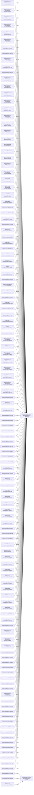

# experiment_registry

```mermaid
graph LR
  n1["qwen3-4b-instruct-2507/prompt-one-turn/exp001:63c3bf0a"]
  n2["cosmetics-ds0.2.0-pl0.2.0-srccosmetics@0.1.0-e616c1e3"]
  n3["qwen3-4b-instruct-2507/prompt-cot/exp007:1d3e96c4"]
  n4["qwen3-4b-instruct-2507/prompt-cot/exp002:8d2a31b4"]
  n5["qwen3-4b-instruct-2507/prompt-cot/exp003:4553090a"]
  n6["qwen3-4b-instruct-2507/prompt-cot/exp005:d4c5f94b"]
  n7["qwen3-4b-instruct-2507/prompt-cot/exp006:43aeb425"]
  n8["phobert-base-v2/lora/exp001:363c224e"]
  n9["visobert/lora/exp001:83dff5ee"]
  n10["qwen3-4b-instruct-2507/prompt-cot/exp004:8b07affe"]
  n11["phobert-base-v2/lora/exp002:61097598"]
  n12["visobert/lora/exp002:384b271d"]
  n13["qwen3-4b-instruct-2507/prompt-cot/exp008:d2ef77a9"]
  n14["qwen3-4b-instruct-2507/prompt-cot/exp009:7cf3331e"]
  n15["qwen3-4b-instruct-2507/prompt-cot/exp011:3c5cf0a0"]
  n16["qwen3-4b-instruct-2507/prompt-cot/exp012:33c2d270"]
  n17["qwen3-4b-instruct-2507/prompt-cot/exp013:779e8738"]
  n18["qwen3-4b-instruct-2507/prompt-cot/exp010:7011d28f"]
  n19["qwen3-4b-instruct-2507/prompt-cot/exp017:bcdb5855"]
  n20["qwen3-4b-instruct-2507/prompt-cot/exp016:91564327"]
  n21["qwen3-0.6b/prompt-cot/exp004:6f52832b"]
  n22["qwen3-0.6b/prompt-cot/exp003:d785decb"]
  n23["qwen3-0.6b/prompt-cot/exp002:0ebdd004"]
  n24["qwen3-0.6b/prompt-cot/exp001:a38f368e"]
  n25["qwen3-4b-instruct-2507/prompt-cot/exp014:fbadcdc3"]
  n26["qwen3-4b-instruct-2507/prompt-cot/exp015:df4b8940"]
  n27["qwen2.5-0.5b-instruct/prompt-cot/exp002:7e42a450"]
  n28["qwen2.5-0.5b-instruct/prompt-cot/exp001:28cd778a"]
  n29["qwen2.5-0.5b-instruct/prompt-cot/exp003:47f42c95"]
  n30["phobert-base-v2/lora/exp003:c0033f3c"]
  n31["visobert/lora/exp003:8b4aeafa"]
  n32["visobert/lora/exp005:511d1e85"]
  n33["phobert-base-v2/lora/exp005:9b7236ac"]
  n34["visobert/lora/exp004:1bc5e80b"]
  n35["phobert-base-v2/lora/exp004:14923c13"]
  n36["vibert-base-cased/lora/exp001:ba615bcb"]
  n37["vibert-base-cased/lora/exp002:4afd60ad"]
  n38["cafebert/lora/exp001:61871aed"]
  n39["xlm-roberta-base/lora/exp002:fb9643d0"]
  n40["xlm-roberta-base/lora/exp001:491e81cb"]
  n41["phobert-large/lora/exp002:2a95b70a"]
  n42["phobert-large/lora/exp001:f92f1d6c"]
  n43["cafebert/lora/exp002:93448395"]
  n44["qwen3-0.6b/prompt-one-turn/exp001:ff3fb8fa"]
  n45["qwen3-0.6b/prompt-cot/exp005:1eb94d3d"]
  n46["cafebert/lora/exp003:8cc11244"]
  n47["vibert-base-cased/lora/exp003:8e1703a6"]
  n48["cafebert/lora/exp004:43e6c243"]
  n49["xlm-roberta-base/lora/exp003:777fafbf"]
  n50["vibert-base-cased/lora/exp004:97cae249"]
  n51["phobert-large/lora/exp003:5b192ca8"]
  n52["cafebert/lora/exp005:cfbf68e4"]
  n53["qwen3-4b-instruct-2507/prompt-aspect/exp004:f39bc983"]
  n54["phobert-base-v2/lora/exp006:d0bfc92e"]
  n55["qwen3-4b-instruct-2507/prompt-aspect/exp005:4e11fb2e"]
  n56["qwen3-4b-instruct-2507/prompt-aspect/exp002:df008443"]
  n57["qwen3-4b-instruct-2507/prompt-aspect/exp007:aee896b8"]
  n58["qwen3-4b-instruct-2507/prompt-aspect/exp006:e3add676"]
  n59["qwen3-4b-instruct-2507/prompt-aspect/exp001:f04dd585"]
  n60["qwen3-4b-instruct-2507/prompt-aspect/exp003:5cab7e03"]
  n61["cafebert/lora/exp006:ba564752"]
  n62["phobert-base-v2/lora/exp007:3e52a2a3"]
  n63["phobert-base-v2/full/exp001:896017a6"]
  n64["cafebert/lora/exp007:be5d198b"]
  n65["cafebert/lora/exp009:8139ebb5"]
  n66["cafebert/lora/exp011:c5224186"]
  n67["cosmetics-ds0.3.0-pl0.3.0-srccosmetics@0.1.0-daebf6ba"]
  n68["cafebert/lora/exp014:b8f33980"]
  n69["cafebert/lora/exp015:eb2b6cfa"]
  n70["cafebert/lora/exp013:bb5a16ba"]
  n71["cafebert/lora/exp008:bb1f4def"]
  n72["cafebert/none/exp002:fd8971e0"]
  n73["cafebert/lora/exp016:4cba4ba7"]
  n74["cafebert/lora/exp017:5ebc6a84"]
  n75["cafebert/lora/exp018:416a1325"]
  n76["phobert-base-v2/none/exp001:91fc1ff0"]
  n77["cafebert/none/exp001:ee0c0c55"]
  n78["phobert-base-v2/none/exp002:5f0ccd74"]
  n79["cafebert/lora/exp019:850333b8"]
  n80["phobert-base-v2/full/exp002:6b4d075b"]
  n81["phobert-base-v2/lora/exp008:4155a02d"]
  n82["phobert-base-v2/lora/exp009:34eadc41"]
  n83["phobert-base-v2/lora/exp010:76d15212"]
  n84["phobert-base-v2/lora/exp011:609b3936"]
  n85["phobert-base-v2/lora/exp012:5f7bafcd"]
  n86["visobert/lora/exp006:e6589d12"]
  n87["visobert/lora/exp009:f784f0b6"]
  n88["visobert/lora/exp008:418c15d6"]
  n89["visobert/lora/exp007:428031b7"]
  n90["qwen3-8b/prompt-cot/exp002:fd1b541e"]
  n91["qwen3-8b/prompt-cot/exp001:f5032055"]
  n92["phobert-base-v2/lora/exp013:354d4577"]
  n93["phobert-base-v2/lora/exp014:3c843f8c"]
  n94["phobert-base-v2/lora/exp015:611af219"]
  n95["phobert-base-v2/lora/exp016:a79a4018"]
  n96["phobert-base-v2/lora/exp018:cf826a43"]
  n97["phobert-base-v2/lora/exp019:b330ac39"]
  n98["phobert-base-v2/lora/exp020:4bb386b8"]
  n99["phobert-base-v2/lora/exp023:034fe8e1"]
  n100["phobert-base-v2/lora/exp021:df66fb42"]
  n101["phobert-base-v2/lora/exp022:ddca71d7"]
  n102["cafebert/lora/exp012:688c32bc"]
  n103["phobert-base-v2/lora/exp017:9be4142b"]
  n104["cafebert/lora/exp010:cb2a0164"]
  n105["mistral-7b-instruct-v0.3/prompt-cot/exp001:667336e2"]
  n106["mistral-7b-instruct-v0.3/prompt-cot/exp002:9c8d8391"]
  n107["qwen3-8b/prompt-cot/exp003:38ba3bf6"]
  n108["cafebert/lora/exp020:2c63348a"]
  n109["cafebert/lora/exp021:4653ddfc"]
  n110["cafebert/lora/exp024:1f009653"]
  n111["cafebert/lora/exp025:9d276e42"]
  n112["cafebert/lora/exp027:43e40f61"]
  n113["cafebert/lora/exp028:d17056e5"]
  n114["cafebert/lora/exp030:1ce21c75"]
  n115["cafebert/lora/exp033:5e2847fc"]
  n116["mistral-7b-instruct-v0.3/prompt-cot/exp003:4a1f6428"]
  n117["cafebert/lora/exp044:311e79fa"]
  n118["cafebert/lora/exp045:880624f8"]
  n119["cafebert/lora/exp046:05e29d98"]
  n120["cafebert/lora/exp047:dd2a2ecd"]
  n121["cafebert/lora/exp048:d27389b7"]
  n122["cafebert/lora/exp050:3e94e69c"]
  n123["cafebert/lora/exp051:745a2440"]
  n124["cafebert/lora/exp053:9acf79d9"]
  n125["cafebert/lora/exp052:81d71ed1"]
  n126["cafebert/lora/exp054:862348ac"]
  n127["cafebert/lora/exp049:c51a9327"]
  n128["cafebert/lora/exp040:49a248c4"]
  n129["cafebert/lora/exp041:73e9f9aa"]
  n130["cafebert/lora/exp043:2f85368a"]
  n1 -->|NEW| n2
  n3 -->|NEW| n2
  n4 -->|NEW| n2
  n5 -->|NEW| n2
  n6 -->|NEW| n2
  n7 -->|NEW| n2
  n8 -->|NEW| n2
  n9 -->|NEW| n2
  n10 -->|RESUME| n2
  n11 -->|NEW| n2
  n12 -->|NEW| n2
  n13 -->|NEW| n2
  n14 -->|NEW| n2
  n15 -->|NEW| n2
  n16 -->|NEW| n2
  n17 -->|NEW| n2
  n18 -->|RESUME| n2
  n19 -->|NEW| n2
  n20 -->|NEW| n2
  n21 -->|NEW| n2
  n22 -->|NEW| n2
  n23 -->|NEW| n2
  n24 -->|NEW| n2
  n25 -->|RESUME| n2
  n26 -->|NEW| n2
  n27 -->|NEW| n2
  n28 -->|NEW| n2
  n29 -->|NEW| n2
  n30 -->|NEW| n2
  n31 -->|NEW| n2
  n32 -->|NEW| n2
  n33 -->|NEW| n2
  n34 -->|NEW| n2
  n35 -->|NEW| n2
  n36 -->|NEW| n2
  n37 -->|NEW| n2
  n38 -->|NEW| n2
  n39 -->|NEW| n2
  n40 -->|NEW| n2
  n41 -->|NEW| n2
  n42 -->|NEW| n2
  n43 -->|NEW| n2
  n44 -->|NEW| n2
  n45 -->|RESUME| n2
  n46 -->|NEW| n2
  n47 -->|NEW| n2
  n48 -->|NEW| n2
  n49 -->|NEW| n2
  n50 -->|NEW| n2
  n51 -->|NEW| n2
  n52 -->|NEW| n2
  n53 -->|NEW| n2
  n54 -->|NEW| n2
  n55 -->|NEW| n2
  n56 -->|NEW| n2
  n57 -->|NEW| n2
  n58 -->|NEW| n2
  n59 -->|NEW| n2
  n60 -->|NEW| n2
  n61 -->|NEW| n2
  n62 -->|NEW| n2
  n63 -->|NEW| n2
  n64 -->|NEW| n2
  n65 -->|NEW| n2
  n66 -->|NEW| n67
  n68 -->|NEW| n2
  n69 -->|NEW| n2
  n70 -->|NEW| n2
  n71 -->|NEW| n2
  n72 -->|NEW| n2
  n73 -->|NEW| n2
  n74 -->|NEW| n2
  n75 -->|NEW| n2
  n76 -->|NEW| n2
  n77 -->|NEW| n2
  n78 -->|NEW| n2
  n79 -->|NEW| n2
  n80 -->|NEW| n2
  n81 -->|NEW| n2
  n82 -->|NEW| n2
  n83 -->|NEW| n2
  n84 -->|NEW| n2
  n85 -->|NEW| n2
  n86 -->|NEW| n2
  n87 -->|NEW| n67
  n88 -->|NEW| n2
  n89 -->|NEW| n2
  n90 -->|RESUME| n2
  n91 -->|RESUME| n2
  n92 -->|NEW| n2
  n93 -->|NEW| n2
  n94 -->|NEW| n67
  n95 -->|NEW| n2
  n96 -->|NEW| n2
  n97 -->|NEW| n2
  n98 -->|NEW| n2
  n99 -->|NEW| n2
  n100 -->|NEW| n2
  n101 -->|NEW| n2
  n102 -->|NEW| n2
  n103 -->|NEW| n2
  n104 -->|NEW| n2
  n105 -->|RESUME| n2
  n106 -->|RESUME| n2
  n107 -->|RESUME| n2
  n108 -->|NEW| n2
  n109 -->|NEW| n2
  n110 -->|NEW| n2
  n111 -->|NEW| n2
  n112 -->|NEW| n2
  n113 -->|NEW| n2
  n114 -->|NEW| n2
  n115 -->|NEW| n2
  n116 -->|RESUME| n2
  n117 -->|NEW| n2
  n118 -->|NEW| n2
  n119 -->|NEW| n2
  n120 -->|NEW| n2
  n121 -->|NEW| n2
  n122 -->|NEW| n2
  n123 -->|NEW| n2
  n124 -->|NEW| n2
  n125 -->|NEW| n2
  n126 -->|NEW| n2
  n127 -->|NEW| n2
  n128 -->|NEW| n2
  n129 -->|NEW| n2
  n130 -->|NEW| n2
```
