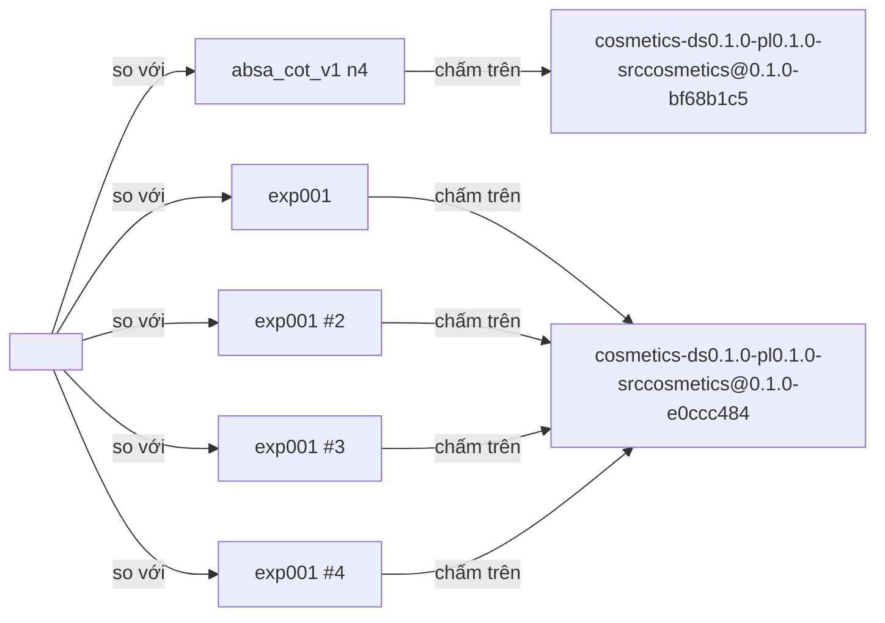

# metrics_matrix

```mermaid
graph LR
  n1["<công bố>"]
  n2["absa_cot_v1 n4"]
  n3["exp001"]
  n4["exp001 #2"]
  n5["exp001 #3"]
  n6["exp001 #4"]
  n7["cosmetics-ds0.1.0-pl0.1.0-srccosmetics@0.1.0-bf68b1c5"]
  n8["cosmetics-ds0.1.0-pl0.1.0-srccosmetics@0.1.0-e0ccc484"]
  n1 -->|so với| n2
  n1 -->|so với| n3
  n1 -->|so với| n4
  n1 -->|so với| n5
  n1 -->|so với| n6
  n2 -->|chấm trên| n7
  n3 -->|chấm trên| n8
  n4 -->|chấm trên| n8
  n5 -->|chấm trên| n8
  n6 -->|chấm trên| n8
```
