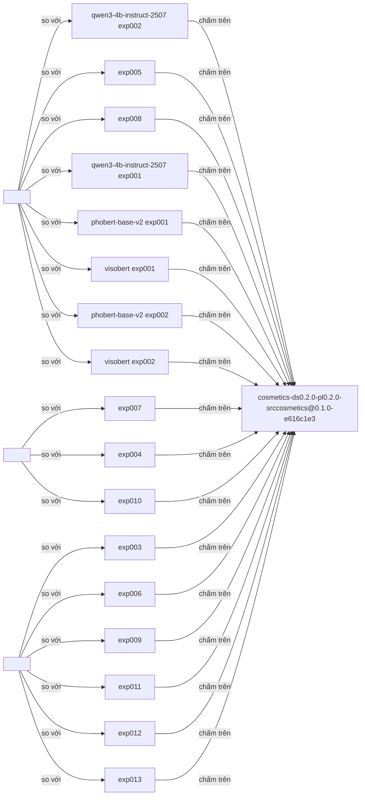

# metrics_matrix

```mermaid
graph LR
  n1["<công bố COT+0-shot>"]
  n2["qwen3-4b-instruct-2507 exp002"]
  n3["exp005"]
  n4["exp008"]
  n5["<công bố COT+1-shot>"]
  n6["exp003"]
  n7["exp006"]
  n8["exp009"]
  n9["exp011"]
  n10["exp012"]
  n11["exp013"]
  n12["<công bố COT+5-shot>"]
  n13["exp007"]
  n14["exp004"]
  n15["exp010"]
  n16["qwen3-4b-instruct-2507 exp001"]
  n17["phobert-base-v2 exp001"]
  n18["visobert exp001"]
  n19["phobert-base-v2 exp002"]
  n20["visobert exp002"]
  n21["cosmetics-ds0.2.0-pl0.2.0-srccosmetics@0.1.0-e616c1e3"]
  n1 -->|so với| n2
  n1 -->|so với| n3
  n1 -->|so với| n4
  n5 -->|so với| n6
  n5 -->|so với| n7
  n5 -->|so với| n8
  n5 -->|so với| n9
  n5 -->|so với| n10
  n5 -->|so với| n11
  n12 -->|so với| n13
  n12 -->|so với| n14
  n12 -->|so với| n15
  n1 -->|so với| n16
  n1 -->|so với| n17
  n1 -->|so với| n18
  n1 -->|so với| n19
  n1 -->|so với| n20
  n16 -->|chấm trên| n21
  n13 -->|chấm trên| n21
  n2 -->|chấm trên| n21
  n6 -->|chấm trên| n21
  n3 -->|chấm trên| n21
  n7 -->|chấm trên| n21
  n17 -->|chấm trên| n21
  n18 -->|chấm trên| n21
  n14 -->|chấm trên| n21
  n19 -->|chấm trên| n21
  n20 -->|chấm trên| n21
  n4 -->|chấm trên| n21
  n8 -->|chấm trên| n21
  n9 -->|chấm trên| n21
  n10 -->|chấm trên| n21
  n11 -->|chấm trên| n21
  n15 -->|chấm trên| n21
```
