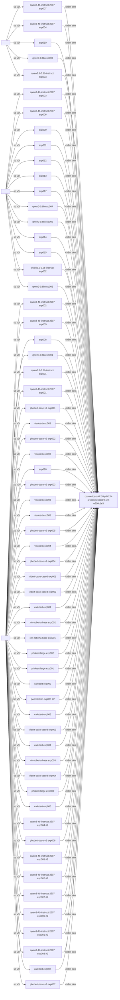

# metrics_matrix

```mermaid
graph LR
  n1["<công bố COT+0-shot>"]
  n2["qwen3-4b-instruct-2507 exp002"]
  n3["qwen3-4b-instruct-2507 exp005"]
  n4["exp008"]
  n5["qwen3-0.6b exp001"]
  n6["qwen2.5-0.5b-instruct exp001"]
  n7["<công bố COT+1-shot>"]
  n8["qwen3-4b-instruct-2507 exp003"]
  n9["qwen3-4b-instruct-2507 exp006"]
  n10["exp009"]
  n11["exp011"]
  n12["exp012"]
  n13["exp013"]
  n14["exp017"]
  n15["qwen3-0.6b exp004"]
  n16["qwen3-0.6b exp002"]
  n17["exp014"]
  n18["exp015"]
  n19["qwen2.5-0.5b-instruct exp002"]
  n20["qwen3-0.6b exp005"]
  n21["<công bố COT+5-shot>"]
  n22["qwen3-4b-instruct-2507 exp007"]
  n23["qwen3-4b-instruct-2507 exp004"]
  n24["exp010"]
  n25["qwen3-0.6b exp003"]
  n26["qwen2.5-0.5b-instruct exp003"]
  n27["qwen3-4b-instruct-2507 exp001"]
  n28["phobert-base-v2 exp001"]
  n29["visobert exp001"]
  n30["phobert-base-v2 exp002"]
  n31["visobert exp002"]
  n32["exp016"]
  n33["phobert-base-v2 exp003"]
  n34["visobert exp003"]
  n35["visobert exp005"]
  n36["phobert-base-v2 exp005"]
  n37["visobert exp004"]
  n38["phobert-base-v2 exp004"]
  n39["vibert-base-cased exp001"]
  n40["vibert-base-cased exp002"]
  n41["cafebert exp001"]
  n42["xlm-roberta-base exp002"]
  n43["xlm-roberta-base exp001"]
  n44["phobert-large exp002"]
  n45["phobert-large exp001"]
  n46["cafebert exp002"]
  n47["qwen3-0.6b exp001 #2"]
  n48["cafebert exp003"]
  n49["vibert-base-cased exp003"]
  n50["cafebert exp004"]
  n51["xlm-roberta-base exp003"]
  n52["vibert-base-cased exp004"]
  n53["phobert-large exp003"]
  n54["cafebert exp005"]
  n55["qwen3-4b-instruct-2507 exp004 #2"]
  n56["phobert-base-v2 exp006"]
  n57["qwen3-4b-instruct-2507 exp005 #2"]
  n58["qwen3-4b-instruct-2507 exp002 #2"]
  n59["qwen3-4b-instruct-2507 exp007 #2"]
  n60["qwen3-4b-instruct-2507 exp006 #2"]
  n61["qwen3-4b-instruct-2507 exp001 #2"]
  n62["qwen3-4b-instruct-2507 exp003 #2"]
  n63["cafebert exp006"]
  n64["phobert-base-v2 exp007"]
  n65["cosmetics-ds0.2.0-pl0.2.0-srccosmetics@0.1.0-e616c1e3"]
  n1 -->|so với| n2
  n1 -->|so với| n3
  n1 -->|so với| n4
  n1 -->|so với| n5
  n1 -->|so với| n6
  n7 -->|so với| n8
  n7 -->|so với| n9
  n7 -->|so với| n10
  n7 -->|so với| n11
  n7 -->|so với| n12
  n7 -->|so với| n13
  n7 -->|so với| n14
  n7 -->|so với| n15
  n7 -->|so với| n16
  n7 -->|so với| n17
  n7 -->|so với| n18
  n7 -->|so với| n19
  n7 -->|so với| n20
  n21 -->|so với| n22
  n21 -->|so với| n23
  n21 -->|so với| n24
  n21 -->|so với| n25
  n21 -->|so với| n26
  n1 -->|so với| n27
  n1 -->|so với| n28
  n1 -->|so với| n29
  n1 -->|so với| n30
  n1 -->|so với| n31
  n1 -->|so với| n32
  n1 -->|so với| n33
  n1 -->|so với| n34
  n1 -->|so với| n35
  n1 -->|so với| n36
  n1 -->|so với| n37
  n1 -->|so với| n38
  n1 -->|so với| n39
  n1 -->|so với| n40
  n1 -->|so với| n41
  n1 -->|so với| n42
  n1 -->|so với| n43
  n1 -->|so với| n44
  n1 -->|so với| n45
  n1 -->|so với| n46
  n1 -->|so với| n47
  n1 -->|so với| n48
  n1 -->|so với| n49
  n1 -->|so với| n50
  n1 -->|so với| n51
  n1 -->|so với| n52
  n1 -->|so với| n53
  n1 -->|so với| n54
  n1 -->|so với| n55
  n1 -->|so với| n56
  n1 -->|so với| n57
  n1 -->|so với| n58
  n1 -->|so với| n59
  n1 -->|so với| n60
  n1 -->|so với| n61
  n1 -->|so với| n62
  n1 -->|so với| n63
  n1 -->|so với| n64
  n27 -->|chấm trên| n65
  n22 -->|chấm trên| n65
  n2 -->|chấm trên| n65
  n8 -->|chấm trên| n65
  n3 -->|chấm trên| n65
  n9 -->|chấm trên| n65
  n28 -->|chấm trên| n65
  n29 -->|chấm trên| n65
  n23 -->|chấm trên| n65
  n30 -->|chấm trên| n65
  n31 -->|chấm trên| n65
  n4 -->|chấm trên| n65
  n10 -->|chấm trên| n65
  n11 -->|chấm trên| n65
  n12 -->|chấm trên| n65
  n13 -->|chấm trên| n65
  n24 -->|chấm trên| n65
  n14 -->|chấm trên| n65
  n32 -->|chấm trên| n65
  n15 -->|chấm trên| n65
  n25 -->|chấm trên| n65
  n16 -->|chấm trên| n65
  n5 -->|chấm trên| n65
  n17 -->|chấm trên| n65
  n18 -->|chấm trên| n65
  n19 -->|chấm trên| n65
  n6 -->|chấm trên| n65
  n26 -->|chấm trên| n65
  n33 -->|chấm trên| n65
  n34 -->|chấm trên| n65
  n35 -->|chấm trên| n65
  n36 -->|chấm trên| n65
  n37 -->|chấm trên| n65
  n38 -->|chấm trên| n65
  n39 -->|chấm trên| n65
  n40 -->|chấm trên| n65
  n41 -->|chấm trên| n65
  n42 -->|chấm trên| n65
  n43 -->|chấm trên| n65
  n44 -->|chấm trên| n65
  n45 -->|chấm trên| n65
  n46 -->|chấm trên| n65
  n47 -->|chấm trên| n65
  n20 -->|chấm trên| n65
  n48 -->|chấm trên| n65
  n49 -->|chấm trên| n65
  n50 -->|chấm trên| n65
  n51 -->|chấm trên| n65
  n52 -->|chấm trên| n65
  n53 -->|chấm trên| n65
  n54 -->|chấm trên| n65
  n55 -->|chấm trên| n65
  n56 -->|chấm trên| n65
  n57 -->|chấm trên| n65
  n58 -->|chấm trên| n65
  n59 -->|chấm trên| n65
  n60 -->|chấm trên| n65
  n61 -->|chấm trên| n65
  n62 -->|chấm trên| n65
  n63 -->|chấm trên| n65
  n64 -->|chấm trên| n65
```
