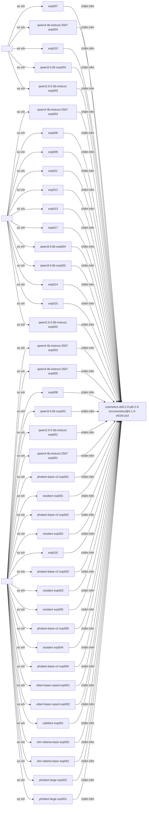

# metrics_matrix

```mermaid
graph LR
  n1["<công bố COT+0-shot>"]
  n2["qwen3-4b-instruct-2507 exp002"]
  n3["qwen3-4b-instruct-2507 exp005"]
  n4["exp008"]
  n5["qwen3-0.6b exp001"]
  n6["qwen2.5-0.5b-instruct exp001"]
  n7["<công bố COT+1-shot>"]
  n8["qwen3-4b-instruct-2507 exp003"]
  n9["exp006"]
  n10["exp009"]
  n11["exp011"]
  n12["exp012"]
  n13["exp013"]
  n14["exp017"]
  n15["qwen3-0.6b exp004"]
  n16["qwen3-0.6b exp002"]
  n17["exp014"]
  n18["exp015"]
  n19["qwen2.5-0.5b-instruct exp002"]
  n20["<công bố COT+5-shot>"]
  n21["exp007"]
  n22["qwen3-4b-instruct-2507 exp004"]
  n23["exp010"]
  n24["qwen3-0.6b exp003"]
  n25["qwen2.5-0.5b-instruct exp003"]
  n26["qwen3-4b-instruct-2507 exp001"]
  n27["phobert-base-v2 exp001"]
  n28["visobert exp001"]
  n29["phobert-base-v2 exp002"]
  n30["visobert exp002"]
  n31["exp016"]
  n32["phobert-base-v2 exp003"]
  n33["visobert exp003"]
  n34["visobert exp005"]
  n35["phobert-base-v2 exp005"]
  n36["visobert exp004"]
  n37["phobert-base-v2 exp004"]
  n38["vibert-base-cased exp001"]
  n39["vibert-base-cased exp002"]
  n40["cafebert exp001"]
  n41["xlm-roberta-base exp002"]
  n42["xlm-roberta-base exp001"]
  n43["phobert-large exp002"]
  n44["phobert-large exp001"]
  n45["cosmetics-ds0.2.0-pl0.2.0-srccosmetics@0.1.0-e616c1e3"]
  n1 -->|so với| n2
  n1 -->|so với| n3
  n1 -->|so với| n4
  n1 -->|so với| n5
  n1 -->|so với| n6
  n7 -->|so với| n8
  n7 -->|so với| n9
  n7 -->|so với| n10
  n7 -->|so với| n11
  n7 -->|so với| n12
  n7 -->|so với| n13
  n7 -->|so với| n14
  n7 -->|so với| n15
  n7 -->|so với| n16
  n7 -->|so với| n17
  n7 -->|so với| n18
  n7 -->|so với| n19
  n20 -->|so với| n21
  n20 -->|so với| n22
  n20 -->|so với| n23
  n20 -->|so với| n24
  n20 -->|so với| n25
  n1 -->|so với| n26
  n1 -->|so với| n27
  n1 -->|so với| n28
  n1 -->|so với| n29
  n1 -->|so với| n30
  n1 -->|so với| n31
  n1 -->|so với| n32
  n1 -->|so với| n33
  n1 -->|so với| n34
  n1 -->|so với| n35
  n1 -->|so với| n36
  n1 -->|so với| n37
  n1 -->|so với| n38
  n1 -->|so với| n39
  n1 -->|so với| n40
  n1 -->|so với| n41
  n1 -->|so với| n42
  n1 -->|so với| n43
  n1 -->|so với| n44
  n26 -->|chấm trên| n45
  n21 -->|chấm trên| n45
  n2 -->|chấm trên| n45
  n8 -->|chấm trên| n45
  n3 -->|chấm trên| n45
  n9 -->|chấm trên| n45
  n27 -->|chấm trên| n45
  n28 -->|chấm trên| n45
  n22 -->|chấm trên| n45
  n29 -->|chấm trên| n45
  n30 -->|chấm trên| n45
  n4 -->|chấm trên| n45
  n10 -->|chấm trên| n45
  n11 -->|chấm trên| n45
  n12 -->|chấm trên| n45
  n13 -->|chấm trên| n45
  n23 -->|chấm trên| n45
  n14 -->|chấm trên| n45
  n31 -->|chấm trên| n45
  n15 -->|chấm trên| n45
  n24 -->|chấm trên| n45
  n16 -->|chấm trên| n45
  n5 -->|chấm trên| n45
  n17 -->|chấm trên| n45
  n18 -->|chấm trên| n45
  n19 -->|chấm trên| n45
  n6 -->|chấm trên| n45
  n25 -->|chấm trên| n45
  n32 -->|chấm trên| n45
  n33 -->|chấm trên| n45
  n34 -->|chấm trên| n45
  n35 -->|chấm trên| n45
  n36 -->|chấm trên| n45
  n37 -->|chấm trên| n45
  n38 -->|chấm trên| n45
  n39 -->|chấm trên| n45
  n40 -->|chấm trên| n45
  n41 -->|chấm trên| n45
  n42 -->|chấm trên| n45
  n43 -->|chấm trên| n45
  n44 -->|chấm trên| n45
```
