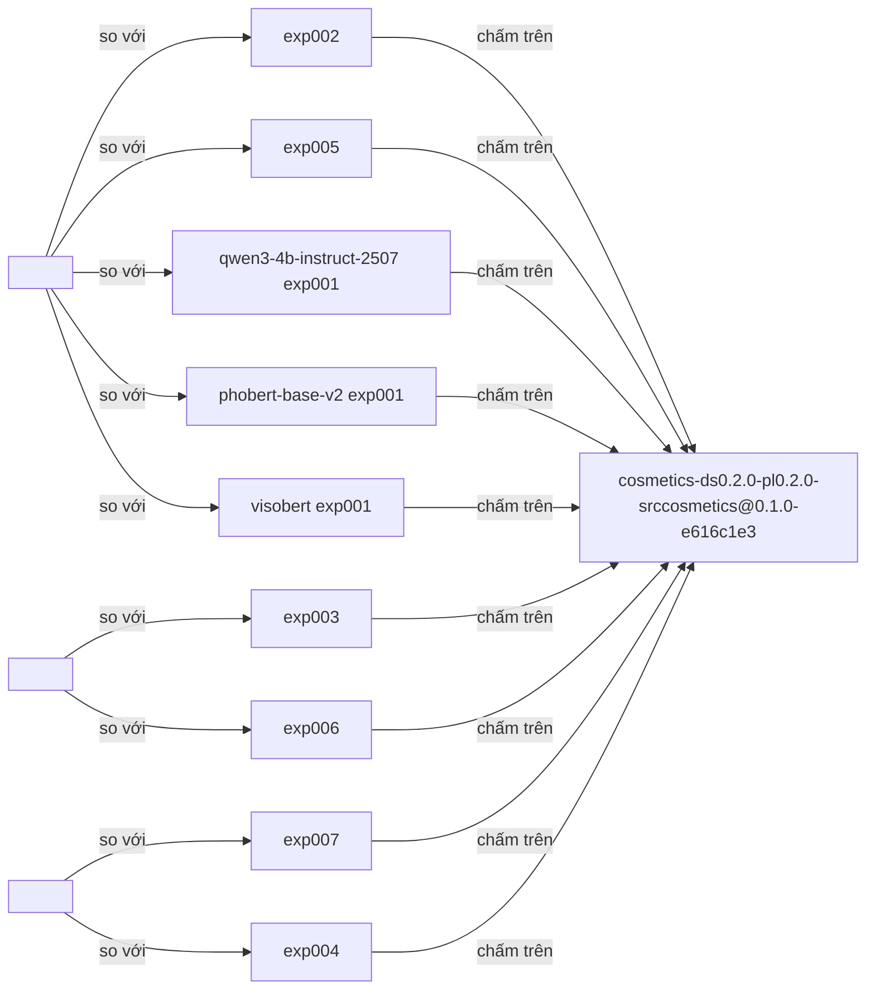

# metrics_matrix

```mermaid
graph LR
  n1["<công bố COT+0-shot>"]
  n2["exp002"]
  n3["exp005"]
  n4["<công bố COT+1-shot>"]
  n5["exp003"]
  n6["exp006"]
  n7["<công bố COT+5-shot>"]
  n8["exp007"]
  n9["exp004"]
  n10["qwen3-4b-instruct-2507 exp001"]
  n11["phobert-base-v2 exp001"]
  n12["visobert exp001"]
  n13["cosmetics-ds0.2.0-pl0.2.0-srccosmetics@0.1.0-e616c1e3"]
  n1 -->|so với| n2
  n1 -->|so với| n3
  n4 -->|so với| n5
  n4 -->|so với| n6
  n7 -->|so với| n8
  n7 -->|so với| n9
  n1 -->|so với| n10
  n1 -->|so với| n11
  n1 -->|so với| n12
  n10 -->|chấm trên| n13
  n8 -->|chấm trên| n13
  n2 -->|chấm trên| n13
  n5 -->|chấm trên| n13
  n3 -->|chấm trên| n13
  n6 -->|chấm trên| n13
  n11 -->|chấm trên| n13
  n12 -->|chấm trên| n13
  n9 -->|chấm trên| n13
```
