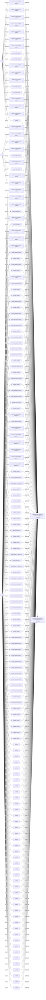

# metrics_matrix

```mermaid
graph LR
  n1["<công bố COT+0-shot>"]
  n2["qwen3-4b-instruct-2507 exp002"]
  n3["qwen3-4b-instruct-2507 exp005"]
  n4["qwen3-4b-instruct-2507 exp008"]
  n5["qwen3-0.6b exp001"]
  n6["qwen2.5-0.5b-instruct exp001"]
  n7["qwen3-8b exp001"]
  n8["mistral-7b-instruct-v0.3 exp001"]
  n9["qwen3-4b-instruct-2507 exp022"]
  n10["<công bố COT+1-shot>"]
  n11["qwen3-4b-instruct-2507 exp003"]
  n12["qwen3-4b-instruct-2507 exp006"]
  n13["qwen3-4b-instruct-2507 exp009"]
  n14["qwen3-4b-instruct-2507 exp011"]
  n15["qwen3-4b-instruct-2507 exp012"]
  n16["qwen3-4b-instruct-2507 exp013"]
  n17["qwen3-4b-instruct-2507 exp017"]
  n18["qwen3-0.6b exp004"]
  n19["qwen3-0.6b exp002"]
  n20["qwen3-4b-instruct-2507 exp014"]
  n21["qwen3-4b-instruct-2507 exp015"]
  n22["qwen2.5-0.5b-instruct exp002"]
  n23["qwen3-0.6b exp005"]
  n24["qwen3-8b exp002"]
  n25["mistral-7b-instruct-v0.3 exp002"]
  n26["qwen3-4b-instruct-2507 exp023"]
  n27["qwen3-4b-instruct-2507 exp025"]
  n28["exp026"]
  n29["qwen3-4b-instruct-2507 exp027"]
  n30["<công bố COT+5-shot>"]
  n31["qwen3-4b-instruct-2507 exp007"]
  n32["qwen3-4b-instruct-2507 exp004"]
  n33["qwen3-4b-instruct-2507 exp010"]
  n34["qwen3-0.6b exp003"]
  n35["qwen2.5-0.5b-instruct exp003"]
  n36["qwen3-8b exp003"]
  n37["mistral-7b-instruct-v0.3 exp003"]
  n38["qwen3-4b-instruct-2507 exp024"]
  n39["qwen3-4b-instruct-2507 exp001"]
  n40["phobert-base-v2 exp001"]
  n41["visobert exp001"]
  n42["phobert-base-v2 exp002"]
  n43["visobert exp002"]
  n44["qwen3-4b-instruct-2507 exp016"]
  n45["phobert-base-v2 exp003"]
  n46["visobert exp003"]
  n47["visobert exp005"]
  n48["phobert-base-v2 exp005"]
  n49["visobert exp004"]
  n50["phobert-base-v2 exp004"]
  n51["vibert-base-cased exp001"]
  n52["vibert-base-cased exp002"]
  n53["cafebert exp001"]
  n54["xlm-roberta-base exp002"]
  n55["xlm-roberta-base exp001"]
  n56["phobert-large exp002"]
  n57["phobert-large exp001"]
  n58["cafebert exp002"]
  n59["qwen3-0.6b exp001 #2"]
  n60["cafebert exp003"]
  n61["vibert-base-cased exp003"]
  n62["cafebert exp004"]
  n63["xlm-roberta-base exp003"]
  n64["vibert-base-cased exp004"]
  n65["phobert-large exp003"]
  n66["cafebert exp005"]
  n67["qwen3-4b-instruct-2507 exp004 #2"]
  n68["phobert-base-v2 exp006"]
  n69["qwen3-4b-instruct-2507 exp005 #2"]
  n70["qwen3-4b-instruct-2507 exp002 #2"]
  n71["qwen3-4b-instruct-2507 exp007 #2"]
  n72["qwen3-4b-instruct-2507 exp006 #2"]
  n73["qwen3-4b-instruct-2507 exp001 #2"]
  n74["qwen3-4b-instruct-2507 exp003 #2"]
  n75["cafebert exp006"]
  n76["phobert-base-v2 exp007"]
  n77["phobert-base-v2 exp001 #2"]
  n78["cafebert exp007"]
  n79["cafebert exp009"]
  n80["cafebert exp011"]
  n81["cafebert exp014"]
  n82["cafebert exp015"]
  n83["cafebert exp013"]
  n84["cafebert exp008"]
  n85["cafebert exp002 #2"]
  n86["cafebert exp016"]
  n87["cafebert exp017"]
  n88["cafebert exp018"]
  n89["phobert-base-v2 exp001 #3"]
  n90["cafebert exp001 #2"]
  n91["phobert-base-v2 exp002 #2"]
  n92["cafebert exp019"]
  n93["phobert-base-v2 exp002 #3"]
  n94["phobert-base-v2 exp008"]
  n95["phobert-base-v2 exp009"]
  n96["phobert-base-v2 exp010"]
  n97["phobert-base-v2 exp011"]
  n98["phobert-base-v2 exp012"]
  n99["visobert exp006"]
  n100["visobert exp009"]
  n101["visobert exp008"]
  n102["visobert exp007"]
  n103["phobert-base-v2 exp013"]
  n104["phobert-base-v2 exp014"]
  n105["phobert-base-v2 exp015"]
  n106["phobert-base-v2 exp016"]
  n107["phobert-base-v2 exp018"]
  n108["phobert-base-v2 exp019"]
  n109["phobert-base-v2 exp020"]
  n110["phobert-base-v2 exp023"]
  n111["phobert-base-v2 exp021"]
  n112["phobert-base-v2 exp022"]
  n113["cafebert exp012"]
  n114["phobert-base-v2 exp017"]
  n115["cafebert exp010"]
  n116["cafebert exp020"]
  n117["cafebert exp021"]
  n118["cafebert exp024"]
  n119["cafebert exp025"]
  n120["cafebert exp027"]
  n121["exp028"]
  n122["exp030"]
  n123["exp033"]
  n124["exp044"]
  n125["exp045"]
  n126["exp046"]
  n127["exp047"]
  n128["exp048"]
  n129["exp050"]
  n130["exp051"]
  n131["exp053"]
  n132["exp052"]
  n133["exp054"]
  n134["exp040"]
  n135["exp041"]
  n136["exp043"]
  n137["exp042"]
  n138["exp049"]
  n139["exp055"]
  n140["exp057"]
  n141["exp058"]
  n142["exp056"]
  n143["exp059"]
  n144["exp060"]
  n145["exp061"]
  n146["exp062"]
  n147["exp063"]
  n148["exp065"]
  n149["exp067"]
  n150["exp064"]
  n151["exp068"]
  n152["exp069"]
  n153["exp074"]
  n154["exp078"]
  n155["exp077"]
  n156["exp075"]
  n157["exp076"]
  n158["exp072"]
  n159["exp066"]
  n160["exp070"]
  n161["exp073"]
  n162["exp071"]
  n163["cosmetics-ds0.2.0-pl0.2.0-srccosmetics@0.1.0-e616c1e3"]
  n164["cosmetics-ds0.3.0-pl0.3.0-srccosmetics@0.1.0-daebf6ba"]
  n1 -->|so với| n2
  n1 -->|so với| n3
  n1 -->|so với| n4
  n1 -->|so với| n5
  n1 -->|so với| n6
  n1 -->|so với| n7
  n1 -->|so với| n8
  n1 -->|so với| n9
  n10 -->|so với| n11
  n10 -->|so với| n12
  n10 -->|so với| n13
  n10 -->|so với| n14
  n10 -->|so với| n15
  n10 -->|so với| n16
  n10 -->|so với| n17
  n10 -->|so với| n18
  n10 -->|so với| n19
  n10 -->|so với| n20
  n10 -->|so với| n21
  n10 -->|so với| n22
  n10 -->|so với| n23
  n10 -->|so với| n24
  n10 -->|so với| n25
  n10 -->|so với| n26
  n10 -->|so với| n27
  n10 -->|so với| n28
  n10 -->|so với| n29
  n30 -->|so với| n31
  n30 -->|so với| n32
  n30 -->|so với| n33
  n30 -->|so với| n34
  n30 -->|so với| n35
  n30 -->|so với| n36
  n30 -->|so với| n37
  n30 -->|so với| n38
  n1 -->|so với| n39
  n1 -->|so với| n40
  n1 -->|so với| n41
  n1 -->|so với| n42
  n1 -->|so với| n43
  n1 -->|so với| n44
  n1 -->|so với| n45
  n1 -->|so với| n46
  n1 -->|so với| n47
  n1 -->|so với| n48
  n1 -->|so với| n49
  n1 -->|so với| n50
  n1 -->|so với| n51
  n1 -->|so với| n52
  n1 -->|so với| n53
  n1 -->|so với| n54
  n1 -->|so với| n55
  n1 -->|so với| n56
  n1 -->|so với| n57
  n1 -->|so với| n58
  n1 -->|so với| n59
  n1 -->|so với| n60
  n1 -->|so với| n61
  n1 -->|so với| n62
  n1 -->|so với| n63
  n1 -->|so với| n64
  n1 -->|so với| n65
  n1 -->|so với| n66
  n1 -->|so với| n67
  n1 -->|so với| n68
  n1 -->|so với| n69
  n1 -->|so với| n70
  n1 -->|so với| n71
  n1 -->|so với| n72
  n1 -->|so với| n73
  n1 -->|so với| n74
  n1 -->|so với| n75
  n1 -->|so với| n76
  n1 -->|so với| n77
  n1 -->|so với| n78
  n1 -->|so với| n79
  n1 -->|so với| n80
  n1 -->|so với| n81
  n1 -->|so với| n82
  n1 -->|so với| n83
  n1 -->|so với| n84
  n1 -->|so với| n85
  n1 -->|so với| n86
  n1 -->|so với| n87
  n1 -->|so với| n88
  n1 -->|so với| n89
  n1 -->|so với| n90
  n1 -->|so với| n91
  n1 -->|so với| n92
  n1 -->|so với| n93
  n1 -->|so với| n94
  n1 -->|so với| n95
  n1 -->|so với| n96
  n1 -->|so với| n97
  n1 -->|so với| n98
  n1 -->|so với| n99
  n1 -->|so với| n100
  n1 -->|so với| n101
  n1 -->|so với| n102
  n1 -->|so với| n103
  n1 -->|so với| n104
  n1 -->|so với| n105
  n1 -->|so với| n106
  n1 -->|so với| n107
  n1 -->|so với| n108
  n1 -->|so với| n109
  n1 -->|so với| n110
  n1 -->|so với| n111
  n1 -->|so với| n112
  n1 -->|so với| n113
  n1 -->|so với| n114
  n1 -->|so với| n115
  n1 -->|so với| n116
  n1 -->|so với| n117
  n1 -->|so với| n118
  n1 -->|so với| n119
  n1 -->|so với| n120
  n1 -->|so với| n121
  n1 -->|so với| n122
  n1 -->|so với| n123
  n1 -->|so với| n124
  n1 -->|so với| n125
  n1 -->|so với| n126
  n1 -->|so với| n127
  n1 -->|so với| n128
  n1 -->|so với| n129
  n1 -->|so với| n130
  n1 -->|so với| n131
  n1 -->|so với| n132
  n1 -->|so với| n133
  n1 -->|so với| n134
  n1 -->|so với| n135
  n1 -->|so với| n136
  n1 -->|so với| n137
  n1 -->|so với| n138
  n1 -->|so với| n139
  n1 -->|so với| n140
  n1 -->|so với| n141
  n1 -->|so với| n142
  n1 -->|so với| n143
  n1 -->|so với| n144
  n1 -->|so với| n145
  n1 -->|so với| n146
  n1 -->|so với| n147
  n1 -->|so với| n148
  n1 -->|so với| n149
  n1 -->|so với| n150
  n1 -->|so với| n151
  n1 -->|so với| n152
  n1 -->|so với| n153
  n1 -->|so với| n154
  n1 -->|so với| n155
  n1 -->|so với| n156
  n1 -->|so với| n157
  n1 -->|so với| n158
  n1 -->|so với| n159
  n1 -->|so với| n160
  n1 -->|so với| n161
  n1 -->|so với| n162
  n39 -->|chấm trên| n163
  n31 -->|chấm trên| n163
  n2 -->|chấm trên| n163
  n11 -->|chấm trên| n163
  n3 -->|chấm trên| n163
  n12 -->|chấm trên| n163
  n40 -->|chấm trên| n163
  n41 -->|chấm trên| n163
  n32 -->|chấm trên| n163
  n42 -->|chấm trên| n163
  n43 -->|chấm trên| n163
  n4 -->|chấm trên| n163
  n13 -->|chấm trên| n163
  n14 -->|chấm trên| n163
  n15 -->|chấm trên| n163
  n16 -->|chấm trên| n163
  n33 -->|chấm trên| n163
  n17 -->|chấm trên| n163
  n44 -->|chấm trên| n163
  n18 -->|chấm trên| n163
  n34 -->|chấm trên| n163
  n19 -->|chấm trên| n163
  n5 -->|chấm trên| n163
  n20 -->|chấm trên| n163
  n21 -->|chấm trên| n163
  n22 -->|chấm trên| n163
  n6 -->|chấm trên| n163
  n35 -->|chấm trên| n163
  n45 -->|chấm trên| n163
  n46 -->|chấm trên| n163
  n47 -->|chấm trên| n163
  n48 -->|chấm trên| n163
  n49 -->|chấm trên| n163
  n50 -->|chấm trên| n163
  n51 -->|chấm trên| n163
  n52 -->|chấm trên| n163
  n53 -->|chấm trên| n163
  n54 -->|chấm trên| n163
  n55 -->|chấm trên| n163
  n56 -->|chấm trên| n163
  n57 -->|chấm trên| n163
  n58 -->|chấm trên| n163
  n59 -->|chấm trên| n163
  n23 -->|chấm trên| n163
  n60 -->|chấm trên| n163
  n61 -->|chấm trên| n163
  n62 -->|chấm trên| n163
  n63 -->|chấm trên| n163
  n64 -->|chấm trên| n163
  n65 -->|chấm trên| n163
  n66 -->|chấm trên| n163
  n67 -->|chấm trên| n163
  n68 -->|chấm trên| n163
  n69 -->|chấm trên| n163
  n70 -->|chấm trên| n163
  n71 -->|chấm trên| n163
  n72 -->|chấm trên| n163
  n73 -->|chấm trên| n163
  n74 -->|chấm trên| n163
  n75 -->|chấm trên| n163
  n76 -->|chấm trên| n163
  n77 -->|chấm trên| n163
  n78 -->|chấm trên| n163
  n79 -->|chấm trên| n163
  n80 -->|chấm trên| n164
  n81 -->|chấm trên| n163
  n82 -->|chấm trên| n163
  n83 -->|chấm trên| n163
  n84 -->|chấm trên| n163
  n85 -->|chấm trên| n163
  n86 -->|chấm trên| n163
  n87 -->|chấm trên| n163
  n88 -->|chấm trên| n163
  n89 -->|chấm trên| n163
  n90 -->|chấm trên| n163
  n91 -->|chấm trên| n163
  n92 -->|chấm trên| n163
  n93 -->|chấm trên| n163
  n94 -->|chấm trên| n163
  n95 -->|chấm trên| n163
  n96 -->|chấm trên| n163
  n97 -->|chấm trên| n163
  n98 -->|chấm trên| n163
  n99 -->|chấm trên| n163
  n100 -->|chấm trên| n164
  n101 -->|chấm trên| n163
  n102 -->|chấm trên| n163
  n24 -->|chấm trên| n163
  n7 -->|chấm trên| n163
  n103 -->|chấm trên| n163
  n104 -->|chấm trên| n163
  n105 -->|chấm trên| n164
  n106 -->|chấm trên| n163
  n107 -->|chấm trên| n163
  n108 -->|chấm trên| n163
  n109 -->|chấm trên| n163
  n110 -->|chấm trên| n163
  n111 -->|chấm trên| n163
  n112 -->|chấm trên| n163
  n113 -->|chấm trên| n163
  n114 -->|chấm trên| n163
  n115 -->|chấm trên| n163
  n8 -->|chấm trên| n163
  n25 -->|chấm trên| n163
  n36 -->|chấm trên| n163
  n116 -->|chấm trên| n163
  n117 -->|chấm trên| n163
  n118 -->|chấm trên| n163
  n119 -->|chấm trên| n163
  n120 -->|chấm trên| n163
  n121 -->|chấm trên| n163
  n122 -->|chấm trên| n163
  n123 -->|chấm trên| n163
  n37 -->|chấm trên| n163
  n124 -->|chấm trên| n163
  n125 -->|chấm trên| n163
  n126 -->|chấm trên| n163
  n127 -->|chấm trên| n163
  n128 -->|chấm trên| n163
  n129 -->|chấm trên| n163
  n130 -->|chấm trên| n163
  n131 -->|chấm trên| n163
  n132 -->|chấm trên| n163
  n133 -->|chấm trên| n163
  n134 -->|chấm trên| n163
  n135 -->|chấm trên| n163
  n136 -->|chấm trên| n163
  n137 -->|chấm trên| n163
  n138 -->|chấm trên| n163
  n139 -->|chấm trên| n163
  n140 -->|chấm trên| n163
  n141 -->|chấm trên| n163
  n142 -->|chấm trên| n163
  n143 -->|chấm trên| n163
  n144 -->|chấm trên| n163
  n145 -->|chấm trên| n163
  n146 -->|chấm trên| n163
  n147 -->|chấm trên| n163
  n9 -->|chấm trên| n163
  n26 -->|chấm trên| n163
  n27 -->|chấm trên| n163
  n28 -->|chấm trên| n163
  n38 -->|chấm trên| n163
  n29 -->|chấm trên| n163
  n148 -->|chấm trên| n163
  n149 -->|chấm trên| n163
  n150 -->|chấm trên| n163
  n151 -->|chấm trên| n163
  n152 -->|chấm trên| n163
  n153 -->|chấm trên| n163
  n154 -->|chấm trên| n163
  n155 -->|chấm trên| n163
  n156 -->|chấm trên| n163
  n157 -->|chấm trên| n163
  n158 -->|chấm trên| n163
  n159 -->|chấm trên| n163
  n160 -->|chấm trên| n163
  n161 -->|chấm trên| n163
  n162 -->|chấm trên| n163
```
