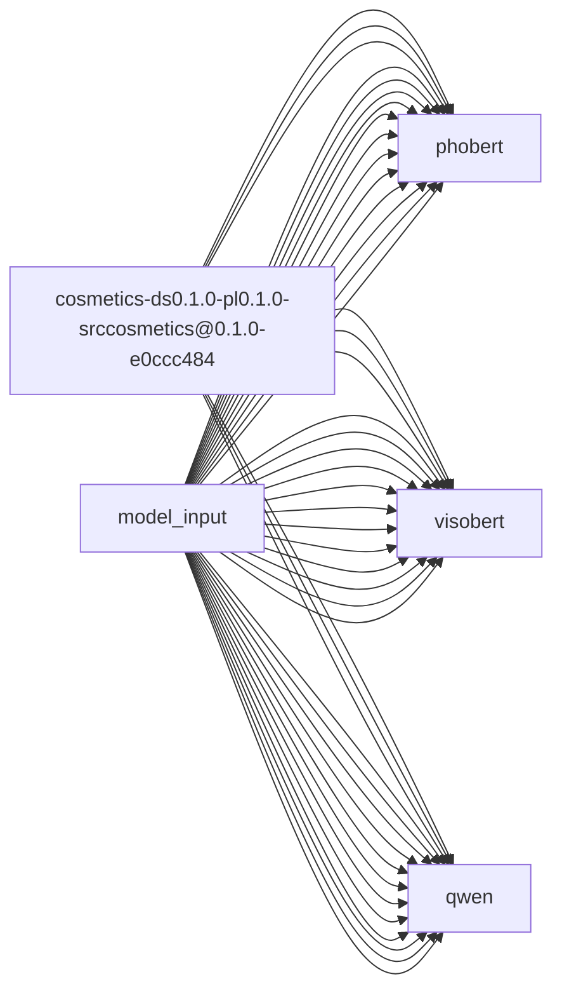

# model_input

```mermaid
graph LR
  n1["cosmetics-ds0.1.0-pl0.1.0-srccosmetics@0.1.0-e0ccc484"]
  n2["phobert"]
  n3["visobert"]
  n4["qwen"]
  n5["model_input"]
  n1 --> n2
  n1 --> n2
  n1 --> n2
  n1 --> n3
  n1 --> n3
  n1 --> n3
  n1 --> n4
  n1 --> n4
  n1 --> n4
  n5 --> n2
  n5 --> n2
  n5 --> n2
  n5 --> n3
  n5 --> n3
  n5 --> n3
  n5 --> n4
  n5 --> n4
  n5 --> n4
  n5 --> n2
  n5 --> n2
  n5 --> n2
  n5 --> n3
  n5 --> n3
  n5 --> n3
  n5 --> n4
  n5 --> n4
  n5 --> n4
  n5 --> n2
  n5 --> n2
  n5 --> n2
  n5 --> n3
  n5 --> n3
  n5 --> n3
  n5 --> n4
  n5 --> n4
  n5 --> n4
  n5 --> n2
  n5 --> n2
  n5 --> n2
  n5 --> n3
  n5 --> n3
  n5 --> n3
  n5 --> n4
  n5 --> n4
  n5 --> n4
```
