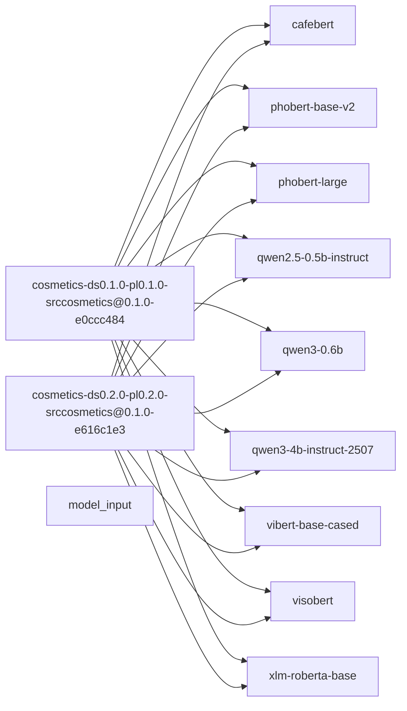

# model_input

```mermaid
graph LR
  n1["cosmetics-ds0.1.0-pl0.1.0-srccosmetics@0.1.0-e0ccc484"]
  n2["cafebert"]
  n3["phobert-base-v2"]
  n4["phobert-large"]
  n5["qwen2.5-0.5b-instruct"]
  n6["qwen3-0.6b"]
  n7["qwen3-4b-instruct-2507"]
  n8["vibert-base-cased"]
  n9["visobert"]
  n10["xlm-roberta-base"]
  n11["cosmetics-ds0.2.0-pl0.2.0-srccosmetics@0.1.0-e616c1e3"]
  n12["model_input"]
  n1 --> n2
  n1 --> n3
  n1 --> n4
  n1 --> n5
  n1 --> n6
  n1 --> n7
  n1 --> n8
  n1 --> n9
  n1 --> n10
  n11 --> n2
  n11 --> n3
  n11 --> n4
  n11 --> n5
  n11 --> n6
  n11 --> n7
  n11 --> n8
  n11 --> n9
  n11 --> n10
```
