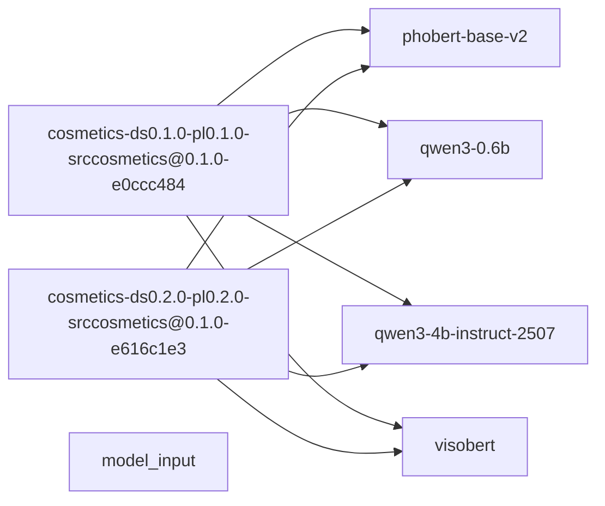

# model_input

```mermaid
graph LR
  n1["cosmetics-ds0.1.0-pl0.1.0-srccosmetics@0.1.0-e0ccc484"]
  n2["phobert-base-v2"]
  n3["qwen3-0.6b"]
  n4["qwen3-4b-instruct-2507"]
  n5["visobert"]
  n6["cosmetics-ds0.2.0-pl0.2.0-srccosmetics@0.1.0-e616c1e3"]
  n7["model_input"]
  n1 --> n2
  n1 --> n3
  n1 --> n4
  n1 --> n5
  n6 --> n2
  n6 --> n3
  n6 --> n4
  n6 --> n5
```
