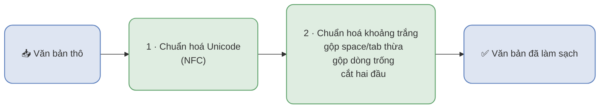

# Module Data Cleaning — chi tiết

> Đọc file này khi: trình bày bước làm sạch văn bản lúc inference.
> Liên quan: `presentations/inference_pipeline.md`, `presentations/model_preprocessing.md`

Lúc inference, Data Cleaning **chỉ chuẩn hoá HÌNH THỨC** — **không** viết lại teencode và **không**
bỏ dấu tiếng Việt. Chỉ có hai bước:

| Bước | Làm gì | Ví dụ |
| --- | --- | --- |
| 1 · Unicode (NFC) | gộp ký tự có dấu về **một** dạng chuẩn (NFD → NFC) | ký tự `e` ghép với dấu sắc → một ký tự `é` |
| 2 · Khoảng trắng | gộp space/tab thừa thành 1 space; gộp nhiều dòng trống thành 1; cắt khoảng trắng hai đầu | `"Son  đẹp\t\tquá  "` → `"Son đẹp quá"` |

**Không** làm: không viết lại teencode (`xjnk` giữ nguyên), không bỏ dấu (`đẹp` giữ nguyên), và
**không loại review nào** — lúc inference ta **đánh giá** review, không vứt nó đi.
