# Cây phát triển thí nghiệm (trạng thái 04/10/2026)

> Đọc file này khi: trình bày dự án đi từ đâu tới đâu, và vì sao mỗi bước lại có mặt.
> Liên quan: `docs/04_experiments/07_evolution.md` (bản đầy đủ), `docs/04_experiments/08_experiment_rationale.md`

**Mười bảy lượt có kết quả, một nhánh chưa có.** Mũi tên là quan hệ **cha - con** (lượt con khác cha đúng
những gì ghi trên mũi tên); đường nét đứt là **đối chiếu** (so kết quả, không phải chạy lại). Số trên mỗi
nút là **accuracy trung bình theo khía cạnh, cơ sở `paper`**, tập `test` 1.623 review.

```mermaid
flowchart TD
    REF["Công bố: GPT-4o-mini + CoT 0/1/5-shot<br/>mốc cần so"]:::ref

    subgraph A["A. Hai encoder học LoRA (4)"]
        A1["visobert/lora/exp001<br/>94,86"]:::keep
        A2["visobert/lora/exp002<br/>+weighted_ce · 95,61"]:::keep
        A3["phobert-base-v2/lora/exp001<br/>88,40"]:::keep
        A4["phobert-base-v2/lora/exp002<br/>+weighted_ce · 96,62"]:::alt
    end

    subgraph B["B. Qwen3-4B + CoT, ba cấu hình sinh (9)"]
        B2["exp002 · 4-bit lô 8 · 0 ví dụ<br/>97,16"]:::keep
        B3["exp003 · 4-bit lô 8 · 1 ví dụ<br/>97,72"]:::keep
        B4["exp004 · 4-bit lô 8 · 5 ví dụ<br/>97,11"]:::keep
        B5["exp005 · fp16 lô 4 · 0 ví dụ<br/>96,62"]:::keep
        B6["exp006 · fp16 lô 4 · 1 ví dụ<br/>96,60"]:::keep
        B7["exp007 · fp16 lô 4 · 5 ví dụ<br/>96,48"]:::keep
        B8["exp008 · 4-bit lô 4 · 0 ví dụ<br/>97,26"]:::keep
        B9["exp009 · 4-bit lô 4 · 1 ví dụ<br/>97,77"]:::best
        B10["exp010 · 4-bit lô 4 · 5 ví dụ<br/>97,19"]:::keep
    end

    subgraph E["E. Ba biến thể bộ 1 ví dụ (3) - CẢ BA ĐỀU ÂM"]
        E1["exp011 · ví dụ có nhãn âm<br/>97,63"]:::drop
        E2["exp012 · thêm bước quét phàn nàn<br/>96,52"]:::drop
        E3["exp013 · lưu ý lệch nhãn<br/>92,66"]:::drop
    end

    subgraph F["F. Qwen3-4B hỏi MỘT lượt (1)"]
        F1["prompt-one-turn/exp001<br/>95,33"]:::keep
    end

    subgraph G["G. Qwen3-0.6B + CoT (0 lượt dùng được) - CHƯA có kết quả"]
        G1["exp001..003 · sáu thư mục đã xoá 04/10/2026<br/>nạp nhầm trọng số 4B và bật suy nghĩ"]:::drop
    end

    REF -.->|so với| B2
    REF -.->|so với| B3
    REF -.->|so với| B4
    REF -.->|so với| B9
    REF -.->|so với| A1
    REF -.->|so với| A3

    B2 -->|"đổi HAI thứ: lượng hoá và lô (8 sang 4)"| B5
    B3 -->|"đổi hai thứ: lượng hoá và lô"| B6
    B4 -->|"đổi hai thứ: lượng hoá và lô"| B7
    B2 -->|"chỉ đổi cỡ lô (8 sang 4), giữ 4-bit"| B8
    B5 -->|"chỉ đổi lượng hoá (fp16 sang 4-bit), giữ lô 4"| B8
    B6 -->|"chỉ đổi lượng hoá, giữ lô 4"| B9
    B7 -->|"chỉ đổi lượng hoá, giữ lô 4"| B10
    B3 -.->|"chỉ đổi nội dung VÍ DỤ"| E1
    B3 -.->|"chỉ đổi CÂU CHỮ prompt (thêm bước 0)"| E2
    B3 -.->|"chỉ đổi CÂU CHỮ prompt (lưu ý lệch nhãn)"| E3
    B2 -.->|"chỉ bỏ phần suy luận"| F1
    B2 -.->|"cùng prompt, khác model (~7 lần nhỏ hơn)"| G1
    A1 -->|"chỉ thêm weighted_ce + inverse"| A2
    A3 -->|"chỉ thêm weighted_ce + inverse"| A4

    classDef ref fill:#E0A93B33,stroke:#E0A93B,stroke-width:1.5px;
    classDef keep fill:#5FA36B33,stroke:#5FA36B,stroke-width:1.5px;
    classDef best fill:#5B7FBD33,stroke:#5B7FBD,stroke-width:2.5px;
    classDef alt fill:#8F6FBF33,stroke:#8F6FBF,stroke-width:2px;
    classDef drop fill:#C0504D22,stroke:#C0504D,stroke-width:2.5px;
```



## Năm nhánh trả lời năm câu khác nhau

| Nhánh | Câu hỏi | Số lượt | Trạng thái |
| --- | --- | --- | --- |
| A | Encoder nhỏ học LoRA bằng nào công bố; có tách từ và không tách từ khác nhau ra sao; và **thêm trọng số lớp** (`weighted_ce`) có cứu được lớp âm không? | 4 | xong |
| B | Qwen3-4B tái hiện được mức 0/1/5 ví dụ của công bố không; lượng hoá 4-bit (so sạch một biến ở lô 4) mất mấy điểm; và **số ô** thay đổi thế nào? | 9 | xong |
| E | Sửa **nội dung ví dụ** và sửa **câu chữ prompt** có cứu được lớp âm không? | 3 | xong - **cả ba đều âm**, hướng này đã bị bỏ |
| F | Bỏ suy luận từng bước thì mất bao nhiêu điểm? | 1 | xong |
| G | Model nhỏ hơn ~7 lần thì kém bao nhiêu? | 0 lượt dùng được (3 thí nghiệm khai, 6 lượt đã chạy đều hỏng) | **chưa có kết quả** - việc kế tiếp, chạy lại với `enable_thinking: false` |

## Một nút đọc thế nào

```
<lượt chạy>  <-  <lượt cha>              (vì sao đi bước này)
    Kết quả: acc TB khía cạnh · F1 sắc thái macro · số ô     Kết luận: giữ / bỏ / đổi hướng
```

Số trong sơ đồ là **accuracy trung bình theo khía cạnh trên cơ sở `paper`** (cách công bố đếm), tập `test`
1.623 review. Nhánh G **không có số** vì cả sáu thư mục kết quả đều không dùng được: ba thư mục **nạp nhầm
trọng số 4B**, ba thư mục đúng 0.6B nhưng **bật suy nghĩ** nên ăn hết trần token và chỉ đọc được
1,36–3,33% số review - chi tiết ở `docs/04_experiments/08_experiment_rationale.md` §5.

Bản đồ hoạ để chiếu/sửa tay: `presentations/experiment_tree.drawio` (mở bằng draw.io Desktop, diagrams.net,
hoặc extension Draw.io Integration trong VS Code). Sơ đồ Mermaid ở trên là bản văn bản để review và để
GitHub render; **hai bản phải giữ cùng nội dung** - sửa một bên thì sửa cả bên.
