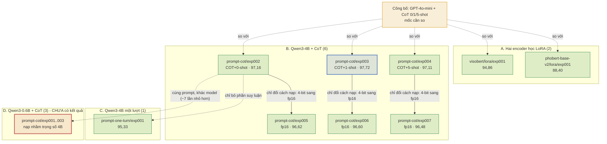

# Cây phát triển thí nghiệm (trạng thái 02/10/2026)

> Đọc file này khi: trình bày dự án đi từ đâu tới đâu, và vì sao mỗi bước lại có mặt.
> Liên quan: `docs/04_experiments/07_evolution.md` (bản đầy đủ), `docs/04_experiments/08_experiment_rationale.md`

Chín lượt có kết quả, một nhánh chưa có. Mũi tên là quan hệ **cha - con** (lượt con khác cha đúng những
gì ghi trên mũi tên); đường nét đứt là **đối chiếu** (so kết quả, không phải chạy lại).



## Bốn nhánh trả lời bốn câu khác nhau

| Nhánh | Câu hỏi | Số lượt | Trạng thái |
| --- | --- | --- | --- |
| A | Encoder nhỏ học LoRA bằng nào công bố, có tách từ và không tách từ khác nhau ra sao? | 2 | xong |
| B | Qwen3-4B tái hiện được mức 0/1/5 ví dụ của công bố không, và lượng hoá 4-bit mất mấy điểm? | 6 | xong |
| C | Bỏ suy luận từng bước thì mất bao nhiêu điểm? | 1 | xong |
| D | Model nhỏ hơn ~7 lần thì kém bao nhiêu? | 3 | **không dùng** - đã xoá kết quả, là việc kế tiếp |

## Một nút đọc thế nào

```
<lượt chạy>  <-  <lượt cha>              (vì sao đi bước này)
    Kết quả: acc TB khía cạnh · F1 sắc thái macro · khớp hoàn toàn     Kết luận: giữ / bỏ / đổi hướng
```

Số trong sơ đồ là **accuracy trung bình theo khía cạnh trên cơ sở `paper`** (cách công bố đếm), tập `test`
1.623 review. Nhánh D **không có số** vì ba lượt đó chạy nhầm trọng số 4B - chi tiết ở
`docs/04_experiments/08_experiment_rationale.md` §5.

Bản đồ hoạ để chiếu/sửa tay: `presentations/experiment_tree.drawio` (mở bằng draw.io Desktop, diagrams.net,
hoặc extension Draw.io Integration trong VS Code). Sơ đồ Mermaid ở trên là bản văn bản để review và để
GitHub render; **hai bản phải giữ cùng nội dung** - sửa một bên thì sửa cả bên.
