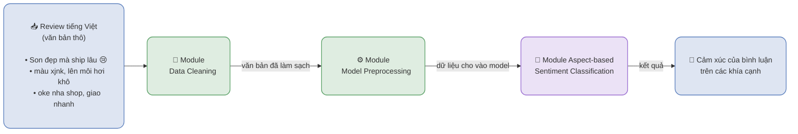

# Inference pipeline — luồng dự đoán một review (tổng quát)

> Đọc file này khi: trình bày luồng inference khi đã có model (serving).
> Liên quan: `presentations/measurement.md`, `docs/00_workflow/04_terms.md`

Sơ đồ ở mức MODULE (không đi vào chi tiết bên trong). Đây là luồng lúc **serving**: một review vào,
cảm xúc trên các khía cạnh ra - không có đọc dataset, không chấm điểm, không ghi `metrics`.

## Ghi chú

- `Module Data Cleaning` = làm sạch **HÌNH THỨC** (chuẩn hoá Unicode, khoảng trắng, gắn cờ nhiễu). Dự
  án **KHÔNG viết lại teencode** và **KHÔNG bỏ dấu tiếng Việt** - model đọc văn bản nguyên bản, nên
  review có icon/teencode vẫn đi tới model gần như nguyên vẹn.
- `Module Model Preprocessing` là bước **RIÊNG của từng model** (tách từ cho PhoBERT; tokenizer; hoặc
  dựng prompt cho Qwen3). Hai loại preprocessing này **không được lẫn** - xem
  `docs/00_workflow/04_terms.md`.
