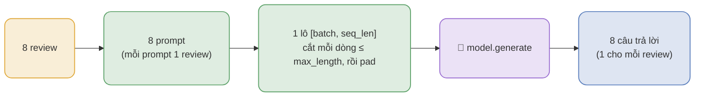

# Lô (batch) của model sinh (LLM): một prompt = một review

> Đọc file này khi: trình bày cách model sinh (LLM) xử lý nhiều review cùng lúc.
> Liên quan: `presentations/token_limit.md`, `docs/04_experiments/02_model_input.md`

## 1. Mỗi review là MỘT prompt riêng

Model sinh nhận **một prompt cho mỗi review**, không nhồi nhiều review vào một prompt:

```text
<|im_start|>system
<chỉ dẫn hệ thống><|im_end|>
<|im_start|>user
<hướng dẫn + ví dụ + 1 review><|im_end|>
<|im_start|>assistant
```

N review → **N prompt** như trên.

## 2. Lô = N prompt chạy trong cùng MỘT lượt



`input_ids` có dạng **[batch, seq_len]**: `dim 0` = số prompt trong lô, `dim 1` = độ dài **từng prompt**. Cắt
(`truncation`) làm **từng dòng** ≤ `max_length`, rồi `padding` đệm về dòng dài nhất ⇒ `seq_len` sau đệm vẫn
≤ `max_length`.

**Vì sao đệm:** lô có N prompt **dài ngắn khác nhau**, model cần tensor chữ nhật `[N, L]` ⇒ đệm dòng ngắn cho
bằng dòng dài nhất; nội dung thật do `attention_mask` quy định (vị trí đệm = 0 → model bỏ qua). Với model
**sinh**, đệm ở **bên trái** (`padding_side="left"`, đặt trong `src/evaluation/runner.py`): mọi prompt **thẳng
hàng về mép PHẢI**, nên phần model **sinh thêm** nằm cùng một cột cho cả lô → cắt `output[:, len(input):]` ra
đúng câu trả lời từng dòng. Đệm **bên phải** (mặc định của transformers) làm phép cắt lấy nhầm chỗ và câu trả
lời vô nghĩa - lỗi im lặng.

## 3. Lô KHÔNG liên quan tới trần token

Model sinh xử lý `batch` prompt như `batch` chuỗi **riêng biệt** - gộp lô KHÔNG cộng dồn thành một chuỗi
dài gấp N lần.

| Yếu tố                                                                    | Áp cho                 | Vai trò                                                  |
| ------------------------------------------------------------------------- | ---------------------- | -------------------------------------------------------- |
| `max_position_embeddings` (trần: 262.144 ở Qwen3-4B, 40.960 ở Qwen3-0.6B) | **từng chuỗi** (dim 1) | chặn độ dài của **một** prompt                           |
| `max_length` (2304)                                                       | **từng chuỗi** (dim 1) | cắt **một** prompt                                       |
| `batch_size` (8 hoặc 4)                                                      | **dim 0**              | số prompt chạy cùng lượt - **chỉ ảnh hưởng VRAM/tốc độ** |

> **Nguồn trần:** đọc từ `config.json` của model - `data/models/Qwen3-4B-Instruct-2507/config.json` cho `max_position_embeddings = 262.144`; `data/models/Qwen3-0.6B/config.json` cho `40.960`. Với **Qwen3-0.6B**: giới hạn **cứng** của kiến trúc là **40.960**, còn **ngữ cảnh native được huấn luyện** là **32.768** (phạm vi đảm bảo chất lượng). Dự án chặn theo giá trị của `config.json` (`40.960`).

## 4. Vì sao `batch_size` khác nhau (LLM)

| Nhóm               | `batch_size` | Lý do                                  |
| ------------------ | ------------ | -------------------------------------- |
| Qwen3-4B **4-bit** | 8            | lượng hoá: bộ nhớ nhỏ, vừa VRAM        |
| Qwen3-4B **fp16**  | 4            | không lượng hoá tốn ~4× bộ nhớ - hạ lô |
| Qwen3-**0.6B**     | 4            | khai trong config model                |

`batch_size` nằm trong **mã băm danh tính** của lượt chạy, nên đổi nó là **một lượt chạy khác**.
