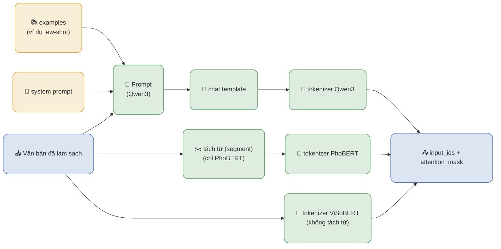

# Module Model Preprocessing — chi tiết

> Đọc file này khi: trình bày bước chuẩn bị đầu vào cho từng model.
> Liên quan: `presentations/inference_pipeline.md`, `presentations/data_cleaning.md`

Mỗi model cần một dạng đầu vào **khác nhau**, nên bước này tách khỏi Data Cleaning. Cả ba đường đều
kết ở **`tokenizer`** — bước **duy nhất sinh ra `input_ids` + `attention_mask`**.



## Tách từ KHÁC tokenizer (đừng lẫn)

| Bước | Vào | Ra |
| --- | --- | --- |
| **Tách từ** (segment) | chuỗi văn bản | **chuỗi** đã nối từ (`Đại học Quốc gia` → `Đại_học Quốc_gia`) — **KHÔNG** ra id |
| **Tokenizer** | chuỗi (đã tách) | **`input_ids` + `attention_mask`** |

## Vì sao PhoBERT tách từ, còn ViSoBERT thì không

- **PhoBERT** được **tiền huấn luyện trên văn bản ĐÃ TÁCH TỪ**, nên bắt buộc tách (bộ chính chủ
  VnCoreNLP; `auto` = vncorenlp → pyvi, **không** lặng lẽ dùng bộ không chính chủ).
- **ViSoBERT** được huấn luyện trên văn bản mạng xã hội ở dạng **nguyên bản**, nên đọc thẳng
  (`segmenter = none` — đây là **chủ ý**, không phải thiếu cấu hình).
- Đổi bộ tách từ **không** đổi tokenizer.

## Qwen3 — chat template là gì

Prompt (nội dung) được bọc bằng **chat template** — khuôn hội thoại của model — rồi mới tokenize.
Với Qwen3 (khuôn ChatML), `conversations(...)` được bọc thành:

```text
<|im_start|>system
<câu hệ thống><|im_end|>
<|im_start|>user
<prompt + review><|im_end|>
<|im_start|>assistant
```

- `add_generation_prompt=True` thêm lượt `assistant` trống ở cuối để model **bắt đầu sinh**.
- Chat template lấy từ **tokenizer của model** (`tokenizer.chat_template`), không hardcode trong code.
- PhoBERT / ViSoBERT **không có** chat template (encoder nhận chuỗi trực tiếp).
