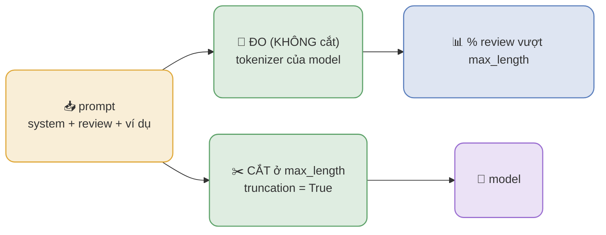

# Ngưỡng token đầu vào và giới hạn của model

> Đọc file này khi: trình bày ngưỡng cắt token đầu vào (`max_length`) và giới hạn của model.
> Liên quan: `presentations/model_preprocessing.md`, `docs/04_experiments/02_model_input.md`

Prompt gửi cho model sinh (Qwen3) gồm **system + review + ví dụ few-shot**, nên độ dài input phải đo bằng
chính tokenizer của model. Mỗi model có một **trần kiến trúc** riêng; dự án **cắt** prompt ở `max_length`
và **chặn** mọi ngưỡng vượt trần, nên input không bao giờ lớn hơn khả năng nhận của model.

## 1. Trần model so với ngưỡng cắt đang dùng

Trần đọc từ `max_position_embeddings` trong config của model (`tokenizer.model_max_length` không dùng
được: tokenizer Qwen khai một số rất lớn, hai tokenizer còn lại trả số sentinel).

| Model | Trần kiến trúc (`max_position_embeddings`) | `max_length` dự án | Dư địa |
| --- | --- | --- | --- |
| PhoBERT | 258 | 256 | 2 |
| ViSoBERT | 514 | 256 | 258 |
| Qwen3-4B-Instruct-2507 | 262.144 | 2304 | 259.840 |
| Qwen3-0.6B | 40.960 | 2304 | 38.656 |

## 2. Đo và cắt là hai việc tách rời

- **ĐO** bằng chính tokenizer của model và **không** cắt → biết độ dài input THẬT và bao nhiêu mẫu vượt ngưỡng.
- **DÙNG** truyền `truncation=True, max_length=2304` → **toàn bộ prompt** (một chuỗi) bị **cắt còn tối đa 2304** token; prompt ngắn hơn 2304 thì nhận **trọn vẹn** (hiện tại **0% bị cắt**).
- Nơi ĐO (`encode()`) và nơi DÙNG (`build_inputs()`) đọc **cùng một** `limit()` từ
  `configs/models/<model_id>.yaml`, nên không thể lệch nhau.
- `max_length` **không được vượt trần model**: lệnh đo **từ chối chạy** nếu vượt (kèm gợi ý dùng giá trị nhỏ hơn).
- Phần **đầu ra** tách riêng: `max_new_tokens = 400` (mặc định).

## 3. Qwen3: token/review thật theo bộ prompt (split `train`, 12.302 review)

Số liệu được đo cho **cả 3 split** (`train`/`val`/`test`) của mọi model; bảng dưới trích `train`, số đầy
đủ ở các file `token_stats__*.csv`.

| Prompt | ví dụ | token/review TB | p50 | p95 | p99 | max | % > 2304 |
| --- | --- | --- | --- | --- | --- | --- | --- |
| `absa_one_turn_v1` | 0 | 257,50 | 252 | 296 | 326 | 502 | 0,00 |
| `absa_direct_v1` | 0 | 229,50 | 224 | 268 | 298 | 474 | 0,00 |
| `absa_cot_zeroshot_v1` | 0 | 372,50 | 367 | 411 | 441 | 617 | 0,00 |
| `absa_cot_1shot_v1` | 1 | 721,50 | 716 | 760 | 790 | 966 | 0,00 |
| `absa_cot_v1` | 2 | 990,50 | 985 | 1.029 | 1.059 | 1.235 | 0,00 |
| `absa_cot_5shot_v1` | 5 | 1.877,50 | 1.872 | 1.916 | 1.946 | **2.122** | 0,00 |

- Mức **5 ví dụ** (mức công bố so) dài nhất **2.122 token** ở train, nên ngưỡng **2304** giữ **0% bị cắt**;
  ngưỡng 1280 trước đây cắt mất phần đuôi của **100%** review ở cả ba split.
- **Nếu** một prompt vượt ngưỡng thì **mất phần cuối** - đúng chỗ đặt yêu cầu định dạng đầu ra và khuôn JSON, nên mẫu đó **mất luôn hướng dẫn định dạng**.
- Một lượt CoT: input **≤ 2304** + output **≤ 400** = **≤ 2704** token, cách xa trần 262.144 của model.

## 4. Vì sao 4 ngưỡng khác nhau

| Model | Input gồm gì | `max_length` | Căn cứ |
| --- | --- | --- | --- |
| PhoBERT | CHỈ review (đã tách từ) | 256 | ngưỡng chính chủ; trần 258; vài review dài 301 (vượt cả trần) nên **0,02% train bị cắt** |
| ViSoBERT | CHỈ review (nguyên bản) | 256 | review dài nhất 229 (**0% cắt**); bằng PhoBERT để cùng ngân sách input |
| Qwen3-4B | prompt + review + ví dụ | 2304 | mức 5 ví dụ dài nhất 2.122 → **0% cắt** |
| Qwen3-0.6B | prompt + review + ví dụ | 2304 | cùng tokenizer + cùng prompt như bản 4B ⇒ cùng số token ⇒ cùng ngưỡng |

- **Khác nhau vì input khác nhau**: encoder nhận **chỉ review** (~30–44 token), LLM nhận **cả prompt** (~230–1.878 token).
- **Cùng nhóm bằng nhau**: hai encoder để 256 cho **cùng ngân sách input** (so sánh công bằng); hai Qwen cùng tokenizer/prompt nên cùng số token nên cùng ngưỡng.
